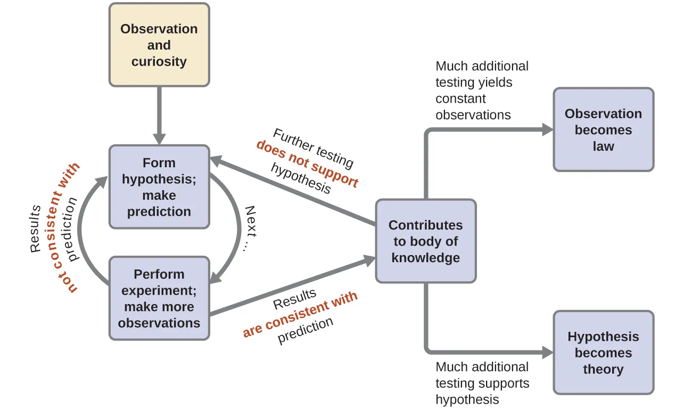

# 1.1.2 化学研究的方法论 - The Methodology of Chemistry

 

上一节中提到，化学属于自然科学，化学研究应在科学范畴之内进行。

 

思考1：元素被定义为组成物质的最基本的单位。古希腊化学家认为物质由4种元素构成：土水火风。古中国化学家认为物质由5种元素构成：金木水火土。假设我们仅按照字面意义来理解这些理论（即"土"只意味着土壤），这两种理论科学吗？

思考2：有人认为，上帝控制一切，所有物质的性质都是由上帝决定的。这种理论有可能是真的吗？这种理论科学吗？

思考3：现代化学认为有至少118个元素，相比于4元素或者5元素的理论，非常不简洁。那118元素理论科学吗？

思考4：（超纲警告）这个世界的基础运行规律一定是简洁的吗？如果不，为什么科学理论要追求简洁？

 

化学是一门基于观察和实验的科学[[2]](https://en.wikipedia.org/wiki/Scientific_method)。通常来说，化学的研究方法及流程如图所示：

研究流程：

1. 对自然界的观察和兴趣使人提出假说，并基于假说进行预测。
2. 设计并进行实验，观察实验现象。
3. 如果假说预测的现象与实验现象不符，则重新提出假说，并重新预测，重新设计实验。
4. 如果假说预测的现象与实验现象相符，则实验结果与假说纳入知识体系。
5. 更多的观察与实验现象相符：实验现象成为规律。
6. 更多的实验不支持假说：修改假说或重新提出假说，重新预测，重新设计实验。
7. 更多的实验支持假说：假说被证实，成为理论。

 

以下是一个通过实验来证明硫酸酸性的例子：

1. 稀硫酸可以使铁锈溶解，猜测硫酸具有酸性。
2. 查阅资料：若滴入的溶液使广泛pH试纸变红，说明溶液有酸性。
3. 查阅资料：若溶液使活泼金属溶解，产生气泡，发热，说明溶液有酸性。
4. 用胶头滴管取一滴质量分数为5%的硫酸，滴在广泛pH试纸上。
5. 观察到pH试纸变红，符合假说。此实验结果与硫酸酸性假说纳入知识体系，但仍需做更多的实验以验证此假说。
6. 将98%的硫酸滴在广泛pH试纸上，观察到试纸变黑，不符合原假说。
7. 查阅资料：一般认为超过70%的硫酸是浓硫酸，低于30%的硫酸是稀硫酸。
8. 重新设计假说：稀硫酸具有酸性。
9. 用胶头滴管分别取质量分数为1%，2%，3%，4%的硫酸，滴在广泛pH试纸上。
10. 观察到pH试纸均变红，符合假说。
11. 取4个烧杯，倒入少量稀硫酸，浸泡镁条，铝条，锌粒，铁粒。
12. 观察到4个烧杯均产生气泡，烧杯壁发热，金属条溶解，符合假说。
13. 稀硫酸与广泛pH试纸反应的实验现象，及稀硫酸与金属反应的实验现象成为规律。
14. 稀硫酸酸性假说被证实，成为理论。

正是这样严谨又复杂的流程，才使得化学，以及所有科学可靠并实用。

 

思考5：上述硫酸酸性实验能证明浓硫酸没有酸性吗？

思考6：（严重超纲警告）哲学家大卫·休谟认为，本质上我们无法证明两件先后发生的事情必存在因果关系，实验物质的性质可能不是实验现象的原因，无论做多少次实验，我们都无法100%确定实验结果。如果实验可能是不可靠的，那么基于实验的科学仍然可靠吗？

 

---

思考1答案：

这些理论本身还算科学，但是被现代化学证伪了。现代化学告诉我们：电解水可以生成2种更基本的元素：氢和氧。而土壤，空气，木头都是混合物；火焰直接不是一种物质；只有金属可能由单一元素构成。所以四元素说和五行说都被证明是错的。不过，在当时的年代，这些理论都是伟大的化学猜想。

后续的章节将详细讨论“元素”，“电解”，“混合物”的知识。

思考2答案：

这个理论确实完全有可能是真的：存在一个无所不能的上帝，将所有的化学家玩弄于股掌之间。但是这个理论不可被证伪，无论发现了什么新现象，都可以解释为这是上帝的旨意，用以考验世人的信仰是否坚定。所以上帝理论并不科学。

思考3答案：

118元素理论（现代化学理论）为了客观真实，牺牲了一部分的简洁性，但这不妨碍其仍然保持着科学性。

思考4答案：

这个世界的运行规律不一定是简洁的。但是，对同一个现象的不同解释中，（假设它们对这个现象解释得一样好），最简洁的那个往往是最接近真实的那个。比如地心说和日心说，这两个理论都不完全正确，但日心说更简洁，也更接近今天的天文理论。

思考5答案：

没有使得ph试纸变红的溶液不一定没有酸性（比如加了蓝墨水的稀硫酸）。此外，与浓硫酸相关的实验做得太少，孤例不成证，完全不能说明浓硫酸是否有酸性。

思考6答案：

这个问题有点复杂，笔者只谈谈自己的看法：

化学，以及所有的自然科学的可靠性来源于对大量实验的正确预测。计算概率的话，化学在极大概率上来说是可靠的。当然，即使这个实验已经重复了无数次，在真正做下一次实验之前，谁也无法保证实验的结果。如果真出现了违背某一化学理论的实验现象，那么只好推翻此理论。但这恰恰说明化学是可证伪的，更加说明其余未被证伪的化学理论的可靠性。

此外，对于一些问题，即使尽最大限度保证所有因素一致，也确实无法得到一致的结果（比如“预测微观粒子的位置）；或者这个问题永远无法设计实验进行观测（比如“研究死后的世界”），那么我们只能暂时放弃它，期待未来更先进的理论工具可以研究这种问题。

总之，想要更深刻地认识这个世界，获得最实用的理论，恐怕需要适当放弃对该理论“绝对可靠”的要求。“绝对可靠”往往意味着“绝对没用”。 

 

对本节内容有贡献的科学家包括：

- 卡尔·波普尔（Karl Popper）：界定"科学"，提出"可证伪"理论

- 亚里士多德（Aristotle）：提出"四元素"理论

- 周公旦？：提出"五行"理论

 

图片来源：

- https://openstax.org/books/chemistry-atoms-first/pages/1-1-chemistry-in-context