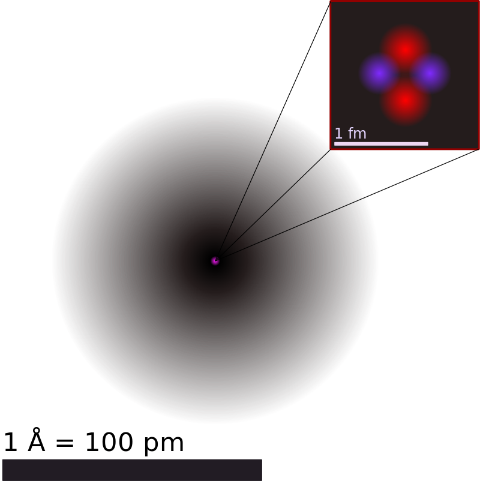
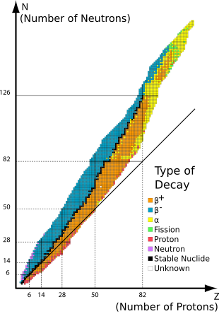

# 1.2.1 原子 - Atoms

 

本节假设读者已经熟悉科学计数法（scientific notation），以及一些基础物理知识，如直径，质量，电性。

 

大量的实验已经证实：**物质由不可分割的粒子构成，而原子就是构成物质的最小单位**[[1]](https://en.wikipedia.org/wiki/Atom)。

 

原子直径大约为100pm（10-10m），质量在1.67 × 10-27kg 至 4.52 × 10-25 kg之间。不同的原子的直径与质量各不相同。

思考1：金属铁由铁原子组成。一个铁原子的质量大约为9.288×10-26kg，请估算1.000kg纯铁中含有多少个铁原子。

 

**原子由原子核和电子构成。原子核位于原子的中心**，其直径大约为10-15m，占据几乎所有原子的重量。**电子在原子核的外部运动。**

**原子核由一定数量的质子和一定数量的中子构成**。下图为氦原子的结构。其中，左下角粉色的点为原子核，周围黑色的"云"代表电子。（更准确地说，代表电子的概率分布。）右上角的图中，紫色和红色粒子分别代表质子和中子。

{: style="height:300px;width:300px" }

 

所有的质子都是完全相同的，中子和电子也如此。**质子的质量与中子的质量相近，而电子质量非常小**，是质子质量的1/1836。**质子带有1个单位的正电荷，中子不带电，电子带有1个单位的负电荷。**质子，中子和电子的物理参数总结如下：

| 粒子 | 质量/kg | 电荷/C | 相对质量 | 相对电荷 |
| :---: | :---: | :---: | :---: | :---: |
| 质子 | 1.6726219 × 10-27 | 1.602176634 × 10-19 | 1 | 1 |
| 中子 | 1.6749274 × 10-27 | 0 | 1 | 0 |
| 电子 | 9.1093837 × 10-31 | -1.602176634 × 10-19 | 0.00055 | -1 |

 

**原子序数（又称核电荷数）为原子的原子核内质子数，用Z表示。原子的原子核内中子数用N表示。原子的质量数（又称核子数）为原子的原子核内质子数加中子数，用A表示。A=Z+N。**

 

**原子的质子数与原子核外的电子数相同，使得原子不带电。**一个稳定的原子核的中子数通常与其质子数接近，或稍大于其质子数，且其质子数和中子数均不能太多。质子数与中子数配比不好的原子核不能稳定存在，会自发衰变成其他原子核。下图为所有存在的原子核列表，横坐标为质子数，纵坐标为中子数，只有黑色的点是稳定的原子核。

{: style="width:500px"}

 

思考2（超纲警告）：亚里士多德认为：物质可以无限细分下去。不借助显微镜等研究微观的仪器，能否推翻他的观点，即，证明物质在微观上由不可分割的粒子构成？

 

稳定的原子很难失去或得到一个质子或者中子。相比而言，原子失去或得到一个或多个电子较为容易。**原子失去或得到电子形成离子（ion）**，有关离子的内容将在后续的章节进一步讨论。

 

---

思考1答案：

纯铁的质量=铁原子的个数×每个铁原子的质量。

1.000kg纯铁中含有铁原子的个数=1.000kg/(9.288×10-26kg)=1.077×1025个。

思考2答案：

不借助直接的显微镜观察，确实不能**证实**物质在微观上由不可分割的粒子构成，但是一些实验现象暗示了这个理论。

定比定律（普鲁斯特）：每一种化合物，无论如何制备，其组成元素的质量比一定。

倍比定律（道尔顿）：若两元素可以生成两种或以上的化合物时，在这些化合物中，一元素的质量固定，则另一元素的质量呈简单整数比。
相比于原子论，物质无限细分论很难解释以上现象。

后续章节将详细讨论有关“化合物”，“元素”的知识。

 

对本节内容有贡献的科学家包括：

- 道尔顿，阿伏伽德罗：提出并完善现代原子论

- 爱因斯坦，佩兰：证明原子论

- 汤姆逊，卢瑟福，查德威克：发现电子，原子核，质子，中子（1935年诺贝尔物理学奖）

- 密里根：测量了电子的电荷量（1923年诺贝尔物理学奖）

- 汤姆逊，卢瑟福，玻尔：提出并完善原子模型

 

图片来源：

- https://openstax.org/books/chemistry-2e/pages/2-2-atomic-structure-and-symbolism
- https://en.wikipedia.org/wiki/Stable_nuclide