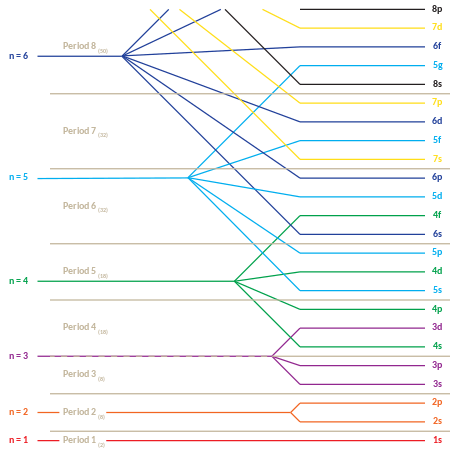
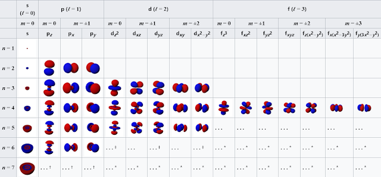

# 1.2.5 原子轨道 - Atomic Orbitals

 

本节内容对于不熟悉量子力学的读者来说比较艰涩，如果读者不打算深入了解，可以仅记住所有标粗的内容，并略读其余部分。

 

在量子力学中，薛定谔方程是描述系统的状态随时间演化的方程。为了确定电子的"运行轨迹"，将原子核和其余电子的信息带入薛定谔方程，可以计算出一组稳定解，称作原子轨道。**原子中的电子在原子轨道上"运行"**。

注：只有氢原子的原子轨道才有精确解，由于电子与电子相互作用，其他原子的原子轨道只有近似解。

注：电子并非像卫星一样环绕在行星周围，而是"弥漫"在原子核附近的区域中，像行星周围的大气层一样。无法确定电子究竟在哪里，只能估算出某一位置原子出现的概率。

原子的原子轨道有无限个。

 

**原子轨道可以用3个参数进行描述：**

- 主量子数（n）（Principal quantum number）
- 角量子数（l）（Azimuthal quantum number）
- 磁量子数（ml）（Magnetic quantum number）

给定3个量子数，可以确定原子的任意一条原子轨道。

 

3个量子数均为整数。主量子数的取值范围为正整数（即1，2，3，4...），可以取至无穷大。角量子数的取值范围为0至主量子数-1之间（即0，1，2，3，...，n-1）。磁量子数的取值范围为正负角量子数之间（即-l，-l+1，...，-1，0，1，...，l-1，l）。量子数不符合上述规律的原子轨道不存在。

相同主量子数的轨道被称作一个电子层（Electron shell），每一个电子层中，相同角量子数的轨道被称作一个亚层（Subshell）。

 

通常会用小写字母s，p，d，f，g... 代表角量子数为0，1，2，3，4... 的轨道。比如，一条主量子数为3，角量子数为1的轨道可以表示为3p（不论其磁量子数为多少）。

简而言之，主量子数影响原子轨道的尺寸与能量，主量子数越大，原子轨道越大，能量越高。角量子数影响原子轨道的形状，角动量与能量，角量子数越大，原子轨道的形状越"复杂"，角动量越大，能量越高。磁量子数决定原子轨道的朝向。

思考1：请判断以下量子数是否代表着一个存在的轨道，如存在，请写出其表示。
1. n=1，l=0，ml=0
2. n=3，l=1，ml=-1
3. n=2，l=2，ml=1
4. n=1，l=1，ml=4
5. n=5，l=1，ml=4

 

**原子轨道的能量仅由主量子数和角量子数决定。**下图右侧为各轨道的相对能量，能量低的轨道画在下方。**建议读者用几分钟时间将10个能量最低的轨道的顺序记熟。（1s，2s，2p，3s，3p，4s，3d，4p，5s，4d）**

 

下图为各原子轨道的的形状。

注：所有的s轨道（第一列）都为球体，图中只展示了下半

**可以近似地认为，s轨道的形状为球形，p轨道的形状为哑铃形，普通的d轨道的形状为4瓣的花瓣形，dz2像是健身用的平衡球形。**

 

有关薛定谔方程与原子轨道的知识将在物理化学部分进一步讨论。

 

---

思考1答案：

1. 存在，1s
2. 存在，3p
3. 不存在，因为n=2时l最大为1
4. 不存在，因为n=1时l只能为0
5. 不存在，因为l=1时ml只能为-1，0，1

 

对本节内容有贡献的科学家包括：

- 玻尔：提出原子的玻尔模型

- 薛定谔：提出薛定谔方程（1933年诺贝尔物理学奖）

- 海森堡，薛定谔，鲍林，马里肯，玻恩：完善量子力学下的电子轨道模型（1932年诺贝尔物理学奖）

 

图片来源：

- https://openstax.org/books/chemistry-2e/pages/6-3-development-of-quantum-theory
- https://openstax.org/books/chemistry-2e/pages/6-3-development-of-quantum-theory