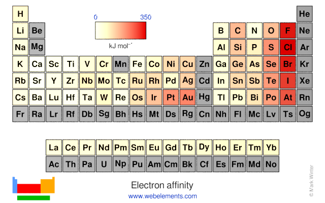

# 1.2.8 元素周期律 - Periodic Law of Elements

 

原子半径（Atomic radius）为从原子核中心到最外层电子的平均距离。

第1电离能（Ionization energy）为从某原子中除去第1个电子所需的最小能量。

电子亲和能（Electron affinity）为使某原子吸附一个电子所释放的能量。

 

原子半径图

 

原子的第1电离能图

 

原子的电子亲和能图，前6周期的灰色元素的电子亲合能为负数

 

思考1：请观察以上各元素的原子半径，第1电离能，和电子亲和能图。请各位门捷列夫们总结出一些规律出来，可能需要以下数据作为参考。

第二周期的各原子的核外电子排布如下所示（各位也可尝试自行写出其核外电子排布）：

- Li: [He]2s1
- Be: [He]2s2
- B: [He]2s22p1
- C: [He]2s22p2
- N: [He]2s22p3
- O: [He]2s22p4
- F: [He]2s22p5
- Ne: [He]2s22p6

第三周期的各原子的核外电子排布如下所示：

- Na: [Ne]3s1
- Mg: [Ne]3s2
- Al: [Ne]3s23p1
- Si: [Ne]3s23p2
- P: [Ne]3s23p3
- S: [Ne]3s23p4
- Cl: [Ne]3s23p5
- Ar: [Ne]3s23p6

 

同一族中的元素，价电子排布（几乎完全）相同。这导致同一族中的元素化学性质相似，且**元素的化学性质随原子序数的增大而呈现出周期性变化**。

以原子半径为例，每一周期中（即元素周期表每一横行中），从左至右，原子的半径逐渐缩小。而从18族到下一个周期的1族元素中，电子填充进下一层原子轨道内，导致原子半径突然增大。

思考2（超纲警告）：为什么同一周期，原子半径逐渐缩小？

 

第1电离能和电子亲和能表的规律略有复杂，但总体而言仍呈规律性分布。

由于亚层处于全空，半满，全满时，原子较为稳定。所以一些族的元素的第1电离能相对较大（不容易失去电子），同时电子亲和能相对较小（不容易结合电子），包括：

- 第2族，s亚层全满，且d亚层全空（(n-1)d0 ns2）（Ca，Sr，Ba）
- 第7族，d亚层半满（(n-1)d5 ns2）（Mn，Tc，Re）
- 第12族，d亚层全满，且p亚层全空（(n-1)d10 ns2）（Zn，Cd，Hg）
- 第15族，p亚层半满（(n-1)d10 ns2 np3）（N，P，As，Sb，Bi）
- 第18族，s，p，d亚层全满，最稳定（(n-1)d10 ns2 np6）（Ne，Ar，Kr，Xe，Rn）

处于这些稳定族的后一族（3，8，13，16，1族）的元素失去一个电子后形成相对稳定的结构，故其第1电离能较小。其中，第1族的元素的第1电离能最小。

处于这些稳定族的前一族（1，6，11，14，17族）的元素得到一个电子后形成相对稳定的结构，故其电子亲合能较大。其中，第17族的元素的电子亲合能最大。

思考3：第2电离能为从某原子中除去第2个电子所需的最小能量。猜测哪一族的第2电离能最小？

 

元素的其他物理、化学性质也或多或少呈现出周期性。

 

---

思考1答案：

从图中可以总结出来的规律有：

- 原子半径从左下角到右上角逐渐减小
- 第1电离能从左下角到右上角逐渐增大，但有一些特例
- 电子亲和能从左下角到右上角逐渐增大，但有一些特例
- 似乎同一族原子的电子亲和能相近。

思考2答案：

解决这道题需要一些物理知识。

原子核带正电，会吸引带负电的电子。当原子核内的质子增加时，其吸引力随之增大，电子云感受到更强的吸力，会向内收缩，导致原子半径收缩。

思考3答案：

第2族（Be，Mg，Ca，Sr，Ba，Ra），因为这些元素在除去了第2个电子之后形成了特别稳定的构型。

 

对本节内容有贡献的科学家包括：

- 门捷列夫：发现了元素周期律
- 莫斯利：确定原子的原子序数，表述了元素周期律

 

图片来源：

- https://www.webelements.com/periodicity/atomic_radius/
- https://www.webelements.com/periodicity/ionis_energy_1/
- https://www.webelements.com/periodicity/electron_affinity/