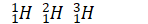

# 1.2.2 元素 - Elements

 

物质的各种变化，依据发生变化的粒子分类，可以分为3类：

- 物理变化：没有新物质产生的变化
- 化学变化：有新物质产生，原子可能重新排列，但原子核不变的变化
- 核嬗变：有原子核变化的变化

通过物理变化体现的性质为物理性质，比如质量，体积，硬度，颜色。通过化学变化体现的性质为化学性质，比如酸性，氧化性，是否可燃，毒性。

注：化学上，不认为"水凝固成为冰"这一过程产生了新物质。因为构成水和冰的微观粒子相同。水的凝固（包括融化，汽化液化，升华凝华）属于物理变化。

 

**化学元素（简称元素）是不能再通过化学变化分解成其他物质的物质**[[1]](https://en.wikipedia.org/wiki/Chemical_element)。

注：但元素仍可以通过除了分解反应之外的其他化学反应，生成其他物质。

同一种化学元素由大量质子数相同的原子构成。

 

所有（化学意义上的）物质都由元素组成，且有些物质是由多于一种元素组成。截至目前，一共发现了118种元素。比如氢，氧，碳，硫，铁等等。

 

**拥有相同原子序数的原子属于同一元素，同一元素中，不同中子数的原子组成的物质（核素）互称同位素。**

例如，氢原子的原子序数为1，即氢元素由一群原子序数均为1的原子（即氢原子）组成，氢元素包含三种（常见的）同位素，这三种同位素的原子核分别含有0个，或1个，或2个中子，即氕，氘，氚。

如果将氢元素中的每个氢原子的核内部注入一个质子，（为了稳定，还需注入0-2个中子，并在核外添加1个电子），氢元素即变成了氦元素，化学性质大不相同。

不是所有的元素都由多种同位素组成，铍元素（Be）只有一种稳定的同位素。

 

**元素的化学性质由其原子序数（即核内质子数，Z）决定，不同元素之间的化学性质千差万别，同一种元素的各同位素的化学性质几乎完全相同。**

 

每一种元素和原子都有一个符号表示，可以是一个大写字母，或者一个大写字母加一个小写字母。比如氢元素和氢原子的符号是H，钠元素和钠原子的符号是Na。

注：原子的化学符号不仅可以表示原子或元素，也可以表示由这种原子组成的物质。

为了区分不同同位素，可以使用同位素表示法：将原子序数Z写在元素符号的左下角，将质量数A写在左上角，如下图所示：

氕，氘，氚，的同位素表示法分别如下所示。

此外，有时也会用到另一种标记，即在原子符号后标记出质量数。如I-127（碘-127），U-235（铀-235）。

思考1：请尝试写出以下原子的同位素表示法：  
    - 带有7个中子的碳原子（碳，C，原子序数为6）  
    - 质量数为35的氯原子（氯，Cl，原子序数为17）  
    - I-127（碘，I，原子序数为53）  

 

如果将不同元素在地壳中按质量占比由大到小排序，前10个最常见的元素如下所示：

| 元素名称 | 符号 | 原子序数 |
|------|----|------|
| 氧    | O  | 8    |
| 硅    | Si | 14   |
| 铝    | Al | 13   |
| 铁    | Fe | 26   |
| 钙    | Ca | 20   |
| 钠    | Na | 11   |
| 钾    | K  | 19   |
| 镁    | Mg | 12   |
| 氢    | H  | 1    |
| 钛    | Ti | 22   |

各元素的分布在人体内，以及宇宙中有所不同。

 

---

思考1答案：

136C

1735Cl

53127I

 

对本节内容有贡献的科学家包括：

- 拉瓦锡：定义元素

- 索迪：发现同位素（1921年诺贝尔化学奖）

- 尤里：发现了氘（1934年诺贝尔化学奖）

- 贝采利乌斯：开发化学符号系统

