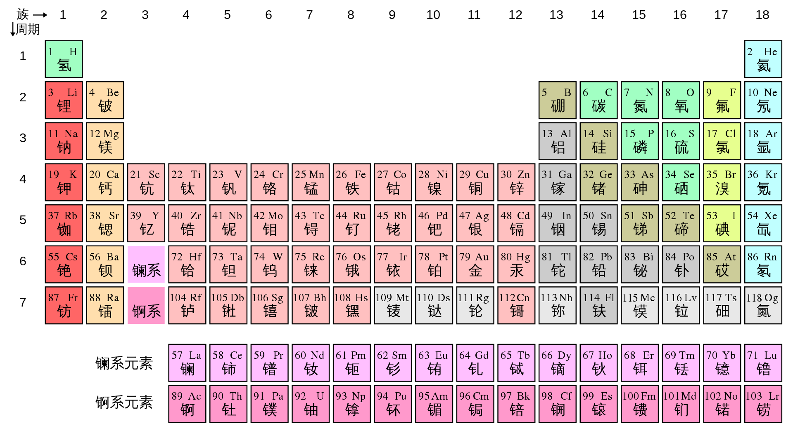

# 1.2.4 元素周期表 - Periodic Table

 

最具有化学感的图当然是元素周期表（Periodic table）了。

元素周期表包括了全部已知的118种元素。每一个格子代表一个元素。图中，左上角为其原子序号，右上角为其元素符号，下方为其简体中文名称。建议读者用几分钟熟悉一下前30个元素的名称，原子序数，和元素符号。

注：简体与繁体中文对同一种元素的命名略有差异，比如硅/矽（Si），锝/鎝（Tc）。

 

**元素周期表的每一行称作一个周期（Period），每一列称作一个族（Group）。目前元素周期表共有7个周期，用阿拉伯数字1-7编号；18个族，编号为1-18。**比如，碳元素位于第2周期，第14族。

注：另一种对族的编号也很常见：第1-18族分别为IA、IIA、IIIB、IVB、VB、VIB、VIIB、VIII、VIII、VIII、IB、IIB、IIIA、IVA、VA、VIA、VIIA、0族。
A代表主族，B代表副族。IA为第1主族，IIIB为第三副族，VIII为第八族，0为第0族。第1，2，13，14，15，16，17族元素为主族元素，第11，12，3，4，5，6，7族元素为副族元素。
注：镥元素和铹元素属于第3族，而前14个镧系元素和前14个锕系元素不属于任何一个族。

**每一族的化学元素之间，化学性质相似。**

思考1：铅元素（Pb）位于第几周期，第几族？

 

元素周期表的左下方为金属（metal）元素（图中的红，橙，粉，灰色元素），右上方的元素为非金属（nonmetal）元素（图中的绿，黄，蓝色元素）。介于金属和非金属中间的元素为准金属（metalloid）元素（图中的军绿色元素）。准金属元素包括硼（B），硅（Si），锗（Ge），砷（As），锑（Sb），碲（Te），砹（At）元素。

注：中文的元素名称的偏旁体现了一个元素是否为金属。除金，汞外，所有带有金字旁的元素均为金属元素（或类似金属的准金属元素），否则均为非金属元素。

相比于非金属元素，金属元素单质的导电性和导热性较好，金属往往具有光泽，具有延展性。此外，在化学反应中，金属元素通常倾向于失去电子，非金属元素通常倾向于得到电子。

 

第1族元素也被称为碱金属（alkali metal），它们化学性质非常活泼。

第2族元素也被称为碱土金属（alkaline earth metal）。

钪，钇，和镧系元素也被成为稀土元素（rare-earth element）。

第17族元素也被成为卤素（halogen），它们化学性质也非常活泼。

第18族元素也被称为稀有气体（noble gas），它们的化学性质很不活泼。

 

---

思考1答案：

铅元素（Pb）位于第6周期，第14族（IVA族）。

 

对本节内容有贡献的科学家包括：

- 门捷列夫：制定元素周期表

 

图片来源：

- https://zh.wikipedia.org/wiki/%E5%85%83%E7%B4%A0%E5%91%A8%E6%9C%9F%E8%A1%A8