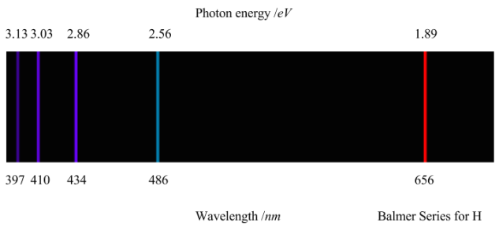
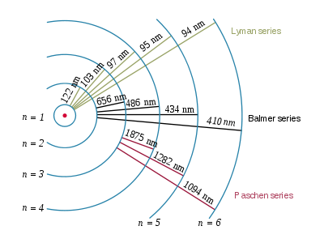
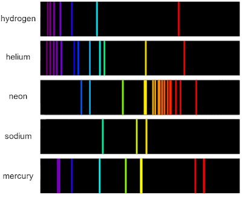

# 1.2.7 原子光谱 - Atomic Spectra

 

本节需要读者稍微熟悉有关电磁波（Electromagnetic wave）的知识。

 

可以通过测量物质的发射光谱（Emission spectrum）来探究其核外电子排布。

**物质的发射光谱是物质的电子从高能态跃迁到低能态（即从能量较高的轨道转移回能量较低的轨道）而发射的电磁辐射的频率谱。**彩虹是太阳的发射光谱。

当原子或分子中的电子被激发时，额外的能量将电子推向更高能量的轨道。当电子回落并离开激发态时，能量以光子的形式重新发射。这些发射的光子形成了元素的光谱。依据能量守恒定律，发射光子的光子能量E等于两个轨道之间的能量差。发射光子的频率（frequency）与其能量成正比 ν=E/h，波长（wavelength）与其能量成反比 λ=hc/E。

下图为氢原子的可见光发射光谱。由于各轨道的能量是不连续的，所以氢原子光谱也是不连续的，以一系列线的形式出现。

注：氢原子在可见光范围外也有光谱，称作紫外光谱（ultraviolet spectrum，UV spectrum）和红外光谱（Infrared spectrum，IR spectrum）。

 

氢原子光谱的谱线的波长符合里德伯公式（Rydberg formula）：

1/λ = R(1/n2 - 1/n'2)

其中R为里德伯常数（Rydberg constant），为1.097*107m-1。在电子跃迁的过程中，n代表能级较低的轨道的能级数（即主量子数），n' 代表代表能级较高的轨道的能级数。（由于氢原子只有一个电子，所以氢原子同一主量子数下的所有轨道能量相同。）

 

n=2时（即电子从更高轨道回落到主量子数为2的轨道（包括2s轨道和2p轨道）时）的光谱谱线称作巴耳末系（Balmer series）。巴耳末系的前4条谱线（n' =3，4，5，6）正好落在可见光区域内（如上图所示）。此外，当n=2时，里德伯公式又名巴耳末公式（Balmer formula）。

n=1时的光谱谱线称作莱曼系（Lyman series），莱曼系的所有谱线都落在紫外区域内。

n=3，4，5，6的光谱谱线分别称作帕邢系（Paschen series），布拉格系（Brackett series），蒲芬德系（Pfund series），韩福瑞系（Humphreys series）。它们均落在红外区域内。

思考1：请计算巴耳末系前4条谱线的波长，精确到小数点后1位。

 

当光通过物质时，物质中的原子或分子可以吸收特定波长的光，从而从低能级跃迁到高能级。这导致通过物质的光中缺少某些波长，形成的光谱被称为吸收光谱（absorption spectrum）。

下图为氢原子的吸收光谱和发射光谱。

在理想情况下，物质的吸收光谱和发射光谱的谱线位置完全一致。

 

当原子有多于1个电子时，由于电子与电子的相互作用，原子的轨道会变得复杂，这导致氢原子外的其他原子的原子光谱更加"混乱"。下图为氢，氦，氖，钠，汞的原子发射光谱。

与原子相比，分子光谱由于包括分子中原子的震动，转动，变得更加复杂。《分析化学》中将介绍物质的紫外-可见光谱，《分析化学》和《有机化学》中将介绍分子的红外光谱。《物理化学》中将探讨分子的光谱的产生机理。

 

---

思考1答案：

当n=2，n’=3时，λ1=1/(1.97*10-7*(1/22-1/32))=6.563*10-7m=656.3nm  
另外3条谱线的计算方法类似，为486.0nm，433.9nm，410.1nm

 

对本节内容有贡献的科学家包括：

- 牛顿：提出并研究光谱

- 夫琅和费：观察到太阳光的光谱的暗线（夫琅和费线）

- 基尔霍夫，本生：观察到发射光谱，创立光谱化学分析法

- 翁斯特罗姆：精确测量氢原子光谱谱线

- 巴耳末：给出计算氢原子可见光谱的经验公式：巴耳末公式

- 里德伯：给出计算氢原子光谱的经验公式：里德伯公式

- 莱曼，帕邢，布拉格，蒲芬德，韩福瑞：发现氢原子的光谱在红外和紫外区间的线系

- 玻尔：提出玻尔模型，解释氢原子光谱（1922年诺贝尔物理学奖）

 

图片来源：

- https://franklyandjournal.wordpress.com/2016/07/18/hydrogen-spectrum/
- https://en.wikipedia.org/wiki/Hydrogen_spectral_series
- https://www.khanacademy.org/science/hs-chemistry/x2613d8165d88df5e:atoms-elements-and-the-periodic-table/x2613d8165d88df5e:the-bohr-model-and-atomic-spectra/a/absorptionemission-lines
- https://xmphysics.com/2023/01/10/17-3-2-emission-spectrum/