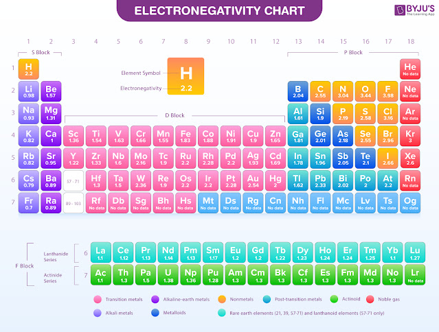

# 1.3.4 化学键 - Chemical Bonds

 

**化学键（Chemical bond）是原子或离子之间的吸引力**[[1]](https://en.wikipedia.org/wiki/Chemical_bond)。分子是由原子通过化学键结合而成的，但化学键也广泛存在于其他不由分子组成的物质中。

 

基于化学键形成的种类分类，可将其分为：

- 共价键（Covalent bond）
- 离子键（Ionic bond）
- 金属键（Metallic bond）

 

此外，分子之间也存在一些较弱的力：

- 氢键（Hydrogen bond）
- 范德华力（Van der Waal force）

注：有的教材会把这两种力也归入进化学键中。

 

**化学键的键能指破坏掉1mol化学键（即"拉开"成键的原子，使其距离无限远）所需的能量。化学键的键能越高，化学键就越强。**键能的单位常用千焦每摩尔（KJ/mol）或千卡路里每摩尔（Kcal/mol）。

由于能量守恒定律，形成化学键时释放的能量等于破坏此化学键时吸收的能量。

思考1：在Br2分子中，两个Br原子中间有一个化学键（Br-Br），其键能为193KJ/mol。[[1]](https://en.wikipedia.org/wiki/Bond_energy) 请问6mol原子状态下的Br原子形成3mol的Br2分子会释放多少能量？

思考2：请把Br2的键的键能换算成Kcal/mol。

思考3：破坏1个Br2分子所需的能量为多少？

 

共价键，离子键，金属键的键能比较高（200-500KJ/mol），氢键居中（5-30KJ/mol[[2]](https://zh.wikipedia.org/wiki/%E6%B0%A2%E9%94%AE)），范德华力的键能比较低（2-4KJ/mol[[3]](https://www.sciencedirect.com/topics/pharmacology-toxicology-and-pharmaceutical-science/van-der-waals-interactions)）。

 

**离子键出现在离子化合物中，由一对阴阳离子通过电磁力吸引形成。**离子键没有方向性（即与同一个原子相连的两个离子键的夹角不影响离子键的强弱）。

 

**共价键出现在分子（如CO2）或多原子离子（如CO32-）中，由原子之间共享电子对形成。**共享的电子对可能会偏向其中一个原子（即离其中的一个原子更近），这与这两种原子的相对"吸引"电子的能力有关。共享电子对明显偏移的共价键是极性共价键，电子对几乎不偏移的共价键是非极性共价键。共价键有方向性（即与同一个原子相连的两个共价键的夹角影响这两个共价键的强弱）。

如果2个原子之间只共享1对电子，则称形成了一个单键（single bond），如果共享2对电子，则称形成了一个双键（double bond），如果共享3对电子，则称形成了一个叁键（triple bond）。通常来说，叁键比双键的键能高，双键比单键的键能高。

 

**元素的电负性（Electronegativity），是该元素的原子在形成化学键时吸引共享电子（即使得电子对偏向该原子）的趋势。**目前最常用的电负性的计算方法为鲍林标度（Pauling scale）。依据此计算方法，Fr（钫）的电负性最小（0.7），最倾向于将电子推离该原子；F（氟）的电负性最大（3.98），最倾向于将电子对拉向该原子。电负性与电离能和电子亲和能的趋势大体相同。

注：共价键和离子键没有绝对的界限，如果共价键的共享电子对强烈偏移向一方，相当于一对电离不完全的离子形成的离子键。

 

当形成一个键的两个元素之间的电负性相差：

- 大于1.7，即认为这个键是离子键
- 在0.5至1.7之间，即认为这个键是极性共价键
- 小于0.5，即认为这个键是非极性共价键

比如，Ca的电负性为1，O的电负性为3.44，Ca和O的电负性相差2.44，Ca和O的键 Ca-O 为离子键。再比如，Al的电负性为1.61，Cl的电负性为3.16，电负性相差1.55，Al和Cl的键是极性共价键。两个电负性不同的原子成键时，电负性小的原子显正电性，电负性大的原子显负电性。

下图为各元素的电负性列表（鲍林标度）。

 

思考4：请计算以下键属于哪种化学键？
- Na-H
- Br-Br
- C-F

思考5：按照以上定义，Pb（铅）能和其他元素形成离子键吗。

 

**金属键出现在金属中，由自由电子与排列整齐的金属离子吸引而成。**

 

后续章节将对氢键和范德华力进行更深入的介绍。

 

---

思考1答案：

6mol的Br原子形成3mol的Br2分子，形成了3mol的Br-Br键。每mol的Br-Br键释放193KJ的能量，所以总共释放3 × 193 = 579KJ的能量。

思考2答案：

1KJ ≈ 0.239Kcal，所以193KJ/mol ≈ 46.1Kcal/mol。

思考3答案：

破坏1个Br2分子所需的能量为193KJ/mol ÷ 6.02 × 1023/mol ≈ 3.21 × 10-19J。

思考4答案：

参考插图里的电负性数据可得：

- Na-H：极性共价键

- Br-Br：非极性共价键

- C-F：极性共价键

思考5答案：

Pb的电负性是2.33，电负性最低的元素是Fr（0.7），电负性最高的元素是F（3.98），相差均不到1.7，所以Pb，从定义上来说，不能和任何元素形成离子键。

 

对本节内容有贡献的科学家包括：

- 路易斯：提出"共价键"

- 鲍林：研究并给出电负性的计算方法

图片来源：

- https://byjus.com/chemistry/electronegativity/