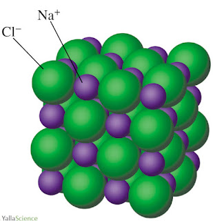
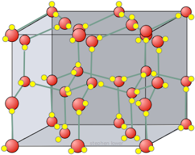
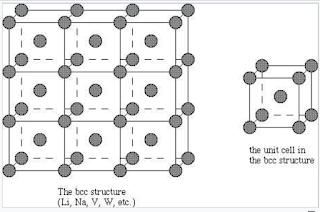
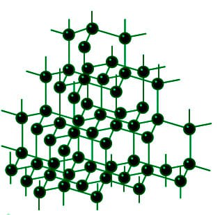

# 1.3.5 物质的构成方式 - The way of matter's constitution

 

本节需要读者稍微熟悉气体（Gas），液体（Liquid），固体（Solid）的知识。

 

有3种粒子可以构成物质：分子，离子，和原子。此外，金属，聚合物和共价网络固体有其独特的构成方法。

 

1、由离子构成的物质（离子化合物/盐）

**如果物质由离子构成，物质内部一定存在离子键。**与分子一样，由离子构成的物质也可以写出其化学式，具体为将组成该物质的离子列出，阳离子（带有正电的离子）写在前面，阴离子（带有负电的离子）写在后面，按照个数比例添加下标。

常见的由离子构成的物质有：NaCl（氯化钠，食盐的主要成分），NaOH（氢氧化钠），NaHCO3（碳酸氢钠，小苏打的主要成分），CaCl2（氯化钙，一种干燥剂），K3PO4（磷酸钾，一种肥料）。

在由离子构成的物质中，各离子紧密排列，阴离子和阳离子通过离子键结合。下图为NaCl的结构片段：

思考1：猜测KOH和MgSO4的名称（可能需要参考1.3.2节的离子名称）

**由离子构成的物质称作离子化合物（Ionic compound），又称盐（Salt）。**

 

2、由分子构成的物质（共价化合物和共价单质）

在1.3.1节中提到，有些物质由分子构成，在这些物质中不存在离子键。分子内部的原子通过共价键连接形成分子，两个分子之间不存在任何强键（包括共价键，离子键，金属键），但存在范德华力，有时也可能存在氢键。下图为固态水（冰）的结构片段，请注意连接两个水分子之间的为氢键，而不是共价键。

**由分子构成的化合物称作分子化合物（Molecular compound），或共价化合物，由分子构成的单质称作共价单质。**

注：由于离子键与共价键没有明显的界限，离子化合物与共价化合物也没有明显的界限。

 

3、由原子构成的物质

**如果物质内部不存在任何强化学键（包括共价键，离子键，金属键），则称物质由原子直接构成**，包括稀有气体（He，Ne，Ar...），以及气相的金属。在这些物质中，原子与原子之间仅存在范德华力。

 

4、金属

（固相和液相的）金属并不由分子，或是离子，或是原子构成。其内部，金属原子紧密排列并电离出电子，金属原子之间通过金属键结合。下图为金属钠的结构示意图。

注：国内初中教材会认为金属由原子构成，但是这个说法并不准确，金属的原子与原子之间的相互作用（金属键）要明显强于稀有气体之间的相互作用（范德华力）。

 

5、聚合物（Polymer）

**聚合物由许多相对分子质量非常大的分子（高分子）构成。**每一个高分子由许多相同（或相似）的分子片段通过共价键连接而成，其相对分子质量在10000以上。常见的聚合物包括聚乙烯（塑料袋的主要成分），聚酯纤维（涤纶），尼龙，蛋白质，DNA，核酸。

 

6、共价网络固体（Covalent network solid）

**在共价网络固体中，原子通过共价键结合在一起，形成连接整个材料的连续网络。**在共价网络固体中，没有单独的分子，或者说，整个共价网络固体材料就是一个分子。常见的共价网络固体包括金刚石（钻石的主要成分），石墨，BN（氮化硼，用作金属磨料），石英，玻璃，充分交联的橡胶。下图为金刚石的结构片段。

注：有人将"共价网络固体"翻译成"原子晶体"，但这个翻译不准确，因为共价网络固体并不一定是晶体，比如玻璃。
注：国内初中教材会认为共价网络固体也由原子构成，但是金刚石和稀有气体的不同点实在是太多了。

 

有一些物质会表现出介于2种分类之间的性质。比如未交联的橡胶属于聚合物，而充分交联的橡胶结构与性质上会更接近共价网络固体。再比如Al与Cl的电负性相差1.55，接近区分共价键与离子键的分界点1.7，从而导致AlCl3（氯化铝）为具有一定离子化合物性质的共价网络固体。

 

思考2：从以上6类物质中的每一类各挑选一种物质，搜索其结构图，查看其组成方法。

 

---

思考1答案：

KOH：氢氧化钾

MgSO4：硫酸镁

思考2答案：

略

 

对本节内容有贡献的科学家包括：

- 施陶丁格：发现聚合物，并确定聚合物的结构

 

图片来源：

- https://chemistry-dictionary.yallascience.com/2017/09/formula-unit-of-nacl-sodium-chloride.html
- https://johncarlosbaez.wordpress.com/2012/04/15/ice/
- https://chem.libretexts.org/Bookshelves/ Inorganic_Chemistry/ Book%3A_Introduction_to_Inorganic_Chemistry_%28Wikibook%29/ 06%3A_Metals_and_Alloys-_Structure_Bonding_Electronic_and_Magnetic_Properties/ 6.04%3A_Crystal_Structures_of_Metals
- https://www.geeksforgeeks.org/diamond-and-graphite-structure-uses-properties-applications/