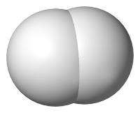
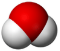
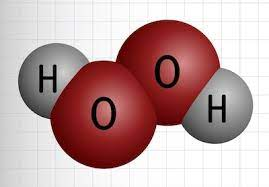
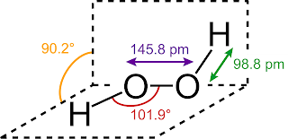

# 1.3.6 分子的几何结构 - Molecular Geometry

 

分子存在于三维空间中，每一个分子都有其稳定的几何结构。

 

通常使用以下几个参数，用来研究分子中原子之间的几何关系：

- 键长（Bond length），分子中两个键合原子的核之间的平均距离。

- 键角（Bond angle）两个键的夹角。

- 二面角（Dihedral angle），三个形成键角的原子组成一个平面，二面角是共享一个键的两个键角的平面之间的角度，又称扭转角。

 

氢气分子（H2）由两个氢原子通过一个共价键连接组成，其键长约0.074nm。氢气分子结构如图所示。

 

水分子（H2O）由一个氧原子分别与两个氢原子成键，两个O-H键的键长相等，为0.096nm，H-O-H键角为104.52°，略小于一个正四面体的键角（109.5°）。

 

过氧化氢分子（H2O2）由2个氧原子和2个氢原子组成。其中，2个氧原子之间存在一个单键，每个氧原子与一个氢原子再分别成键。O-O键长为0.146nm，O-H键长为0.099nm，H-O-O键角为101.9°，H-O-O-H的二面角为90.2°。

 

---

图片来源：

- https://zh.wikipedia.org/zh-hans/%E6%B0%AB%E6%B0%A3
- https://chem.libretexts.org/Bookshelves/Introductory_Chemistry/Introductory_Chemistry_(CK-12)/15%3A_Water/15.01%3A_Structure_of_Water
- https://www.wattagnet.com/poultry-future/article/15535078/hydrogen-peroxide-shows-promise-to-disinfect-hatcheries
- https://en.m.wikipedia.org/wiki/File:H2O2_solid_structure.svg