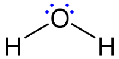
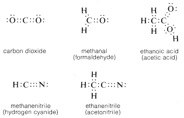
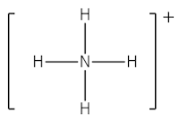
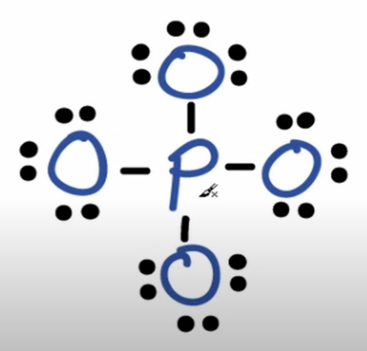
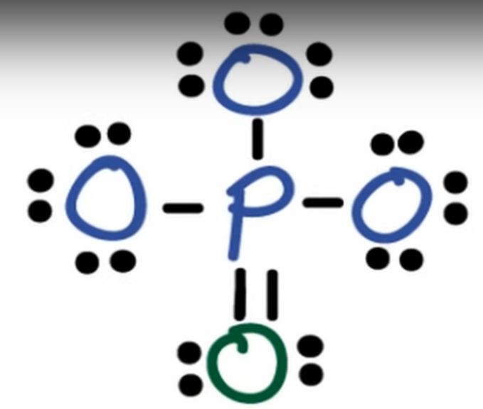
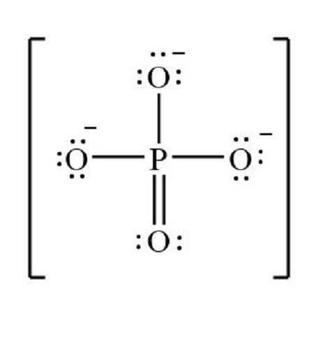
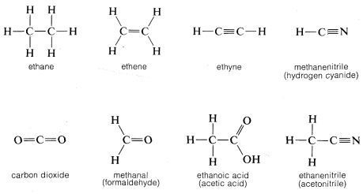
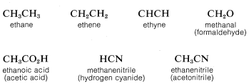
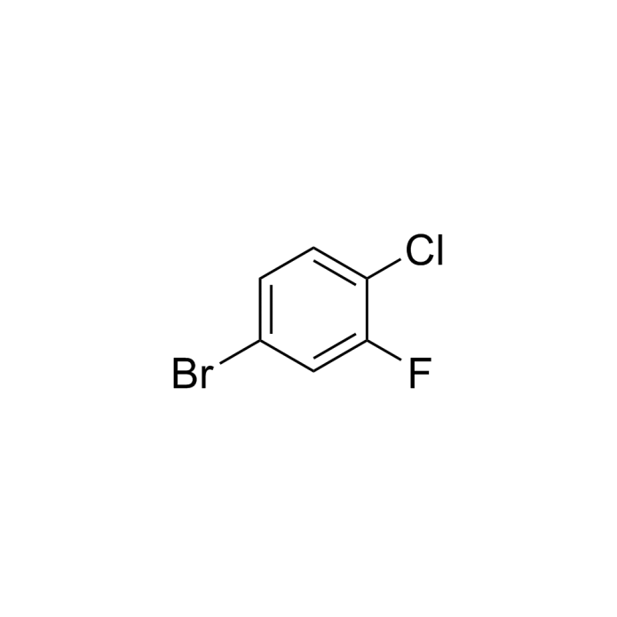
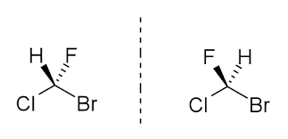

# 1.3.7 结构式 - Structural Formulas

 

在化学中，通常使用路易斯结构式（Lewis structure）来表示分子或离子中，原子之间的成键状态，以及孤对电子分布：

- 用两个点或单实线代表一个单键
- 用四个点或双实线代表一个双键
- 用六个点或三重实线代表一个叁键
- 如果原子上有未成对的孤对电子（lone pair，不参与形成共价键的一对价电子），则用两个成对的圆点表示
- 单电子则用单个小圆点表示
- 如果某一个原子带有电荷，则将电荷直接标记在原子附近

 

下图为水分子的路易斯结构式，化学键使用实线表示：

注：水分子中的氧原子，形成分子前有6个价电子；形成分子后，2个电子分别用于与两个氢原子成键，剩余4个电子形成2对孤对电子，有8个价电子。

 

下图为二氧化碳，甲醛，乙酸，氰化氢，和乙腈的路易斯结构式，化学键使用圆点表示：

 

思考1：请计算氰化氢（HCN）分子中的C原子和N原子的价电子数量（即孤对电子数×2+键数×2）。

注1：共价键的电子算作双方共有。

注2：双键为共享了4个电子，叁键为共享了6个电子。

 

对于不知道具体电荷分布的离子，或者电荷分散在不同原子上的离子而言，首先画出其路易斯结构式，然后使用一个方括号括起来，在括号外面标注出离子的电荷量。

下图为NH4+（铵根）的路易斯结构式。

 

对于更复杂的分子或离子，可以通过计算其总价电子数和形式电荷来画出其路易斯结构式。以磷酸根（PO43-）为例：

P有5个价电子，每个O有6个价电子，整个离子带3个负电，所以总共有5+4×6+3=32个价电子。

依据化学常识，P是中心原子，周围连着4个O原子。画出这一结构，并用单键连接P原子和每个O原子。为所有的原子补齐孤对电子，形成8电子稳定结构。如图所示。

{: style="width:400px" }

计算此结构对应的电子数：4×2+6×4×2=32，等于价电子数，说明不用增加或减少额外的电子。

计算各原子的形式电荷（Formal charge，即假设所有化学键中的电子在原子之间平等共享，计算每一个原子所带的电荷）。在画分子或离子的路易斯结构时，应使得每个原子的形式电荷尽可能等于0。

形式电荷 = 中性原子的价电子数 - 孤对电子数×2 - 化学键数

图中所示的结构中，O的形式电荷为6-3×2-1=-1，P的形式电荷为5-4=1。我们可以通过将一个O原子的孤对电子移成P-O π 键，来使得P原子和1个O原子的形式电荷为0。如图所示：

{: style="width:400px" }

最后，标注电荷，然后用方括号把整个结构括起来。

 

如果在路易斯结构式中用实线代表键，并省略所有的孤对电子，则称为结构式（structural formulas）。

下图为乙烷，乙烯，乙炔，氰化氢，二氧化碳，甲醛，乙酸，乙腈的结构式：

{: style="width:700px" }

 

如果进一步把结构式的一部分（或者所有的）化学键都省略掉，则称为结构简式（condensed formulas）。

下图为乙烷，乙烯，乙炔，甲醛，乙酸，氰化氢，乙腈的结构简式：

{: style="width:700px" }

 

思考2：请写出水分子的结构式和结构简式。

 

此外，如果在结构式的基础上，省略所有的碳原子和氢原子，以及连接氢原子的单键，则称为键线式（Skeletal formula）。键线式在表达有机物时特别直观。

下图为4-溴-1-氯-2-氟苯的键线式：

{: style="width:400px" }

 

对于结构式，结构简式和键线式而言，实心楔形线表示原子伸出纸面上方，虚线表示原子伸出纸面下方。对于下图左侧的氟氯溴甲烷分子而言，氢原子在纸面上方，而氟原子在纸面下方。下图右侧的氟氯溴甲烷分子则正好相反。

注：这两种氟氯溴甲烷分子并不相同，但互相镜面对称。如果一个粒子与其镜面对称的粒子不能互相重叠，则称这种粒子具有手性（Chirality）。后续章节将对手性作进一步的介绍。

 

有些分子或离子不能仅由1种路易斯结构式来表示。比如碳酸根离子存在3种路易斯结构式，其真实的结构可以用这三种路易斯结构式的叠加状态来表示。

对于这种分子或离子，可以使用共振式来表示，即，画出每一种路易斯结构式，并使用双头箭头（ ⟷ ）连接这些结构式。

注：碳酸根离子有三个共振式不意味着碳酸根离子有三种存在形式，也不意味着真实的碳酸根离子处在这三种共振式的快速切换状态。碳酸根离子稳定在这三种路易斯结构式表示的状态的"平均状态"上。

 

---

思考1答案：

C原子：0 + 4×2 = 8

N原子：2×2 + 3×2 = 10

思考2答案：

结构式：H-O-H

结构简式：H2O

 

对本节内容有贡献的科学家包括：

- 路易斯：发明路易斯结构式
- 鲍林：提出共振论

 

图片来源：

- https://en.wikipedia.org/wiki/Lewis_structure
- https://chem.libretexts.org/Bookshelves/Organic_Chemistry/ Basic_Principles_of_Organic_Chemistry_(Roberts_and_Caserio)/ 02%3A_Structural_Organic_Chemistry/ 2.01%3A_Structural_Formulas
- https://www.youtube.com/watch?v=gl4d80g6cow
- https://homework.study.com/explanation/draw-the-lewis-structure-for-po43-and-determine-its-electron-and-molecular-geometries.html
- https://www.kingchemchina.com/Cn/Index/pageView/catid/49/id/378.html