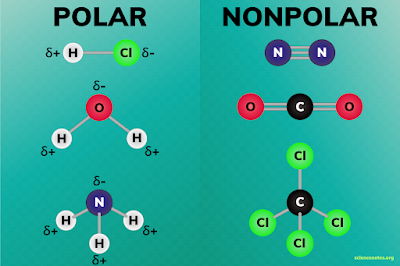

# 1.3.8 分子的极性 - Molecular Polarity

 

如果一个分子的正电荷中心与负电荷中心不重叠，则称这个分子拥有极性（polarity），这个分子是个极性分子（polar molecule）。如果一个分子的正电荷中心与负电荷中心几乎重叠，这个分子是非极性分子（nonpolar molecule）。

极性的判断有一个稍微简单的方法：如果一个分子内含有有极性的共价键（电子对有偏移的共价键），且其极性不能通过分子本身的对称性互相抵消，则该分子是极性分子。否则该分子是非极性分子。

极性影响分子的许多物理性质，包括表面张力、溶解度、熔点和沸点。

 

极性分子的正电荷中心标为δ+，负电荷中心标为δ-，如图所示：

 

思考1：请判断氢气分子，水分子，和过氧化氢分子是否是极性分子。

注：这三个分子的结构可参考1.3.6章。

 

正电荷和负电荷不重合的粒子是偶极子（dipoles）。极性分子是永久偶极子（Permanent dipoles），非极性分子虽然没有永久偶极，但由于分子内部的电子不断运动，当电子碰巧比分子中的另一个位置更集中时，分子会变成瞬时偶极子（Instantaneous dipoles）。

此外，当一个永久偶极子靠近一个非极性分子时，会使得非极性分子的电荷分布发生改变，使得其变成一个感应偶极子（Induced dipoles）。这个过程叫做极化（polarized）。

 

偶极矩（dipole moment）是反应分子的极性大小的物理量，其数值等于正电荷中心与负电荷中心距离之差乘以电荷量，单位为Debye。

 

之前的章节提到分子之间存在范德华力。其本质是由于分子存在永久偶极或瞬时偶极，分子或原子之间存在非定向的、无饱和性的、较弱的相互作用力。范德华力由3种力组成：

- （伦敦）色散力（London dispersion force）：瞬时偶极分子与瞬时偶极分子之间的吸引力

- 诱导力（Debye force）：永久偶极分子对的瞬时偶极分子诱导出的偶极的吸引力

- 取向力（Keesom force）：永久偶极分子与永久偶极分子之间的吸引（排斥）力

注：有些定义也会把原子之间的排斥力纳入范德华力。

 

氢键是一种特殊的取向力，其出现在以共价键连接者一个原子的氢原子 与另一个原子之间，以X-H···Y表示。

只有当X和Y为两个电负性较强且原子半径较小的原子时，才会形成氢键。X和Y通常只可能是N，O，F，极少见的情况下会是C。除此之外的任何原子都不能形成氢键。例如，N-H 与 F之间可能产生氢键，O-H 与 N之间也可能产生氢键，但C-H 与 Si之间就不可能产生氢键。

在纯水中，广泛出现O-H···O氢键，这些氢键提高了水的沸点。纯氨，氟化氢中也会出现氢键。

 

---

思考1答案：

氢气分子：没有极性键，不是极性分子

水分子：有极性键，不能通过分子对称性抵消（即键角不是180°），是极性分子

过氧化氢分子：有极性键，且由于二面角，不能通过分子对称性抵消，是极性分子

 

对本节内容有贡献的科学家包括：

- 范德华：研究范德华力

- 德拜：研究极性分子的偶极（1936年诺贝尔化学奖）

 

图片来源：

- https://sciencenotes.org/polar-and-nonpolar-molecules/