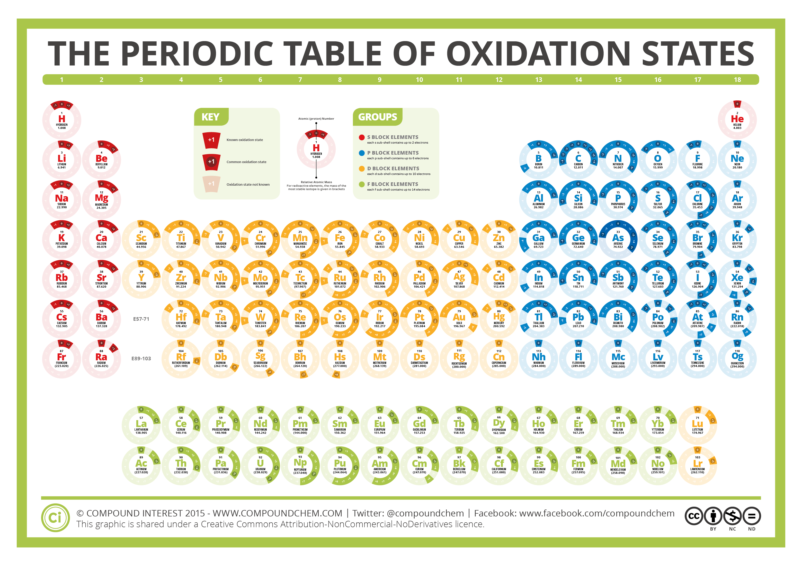

# 1.3.9 氧化态 - Oxidation State

 

思考1：观察由以下离子构成的化合物的化学式，尤其是下标。

|| Na+ | Mg2+ | Al3+ |
|----------|----------|----------|----------|
| Cl- | NaCl     | MgCl2 | AlCl3 |
| Br- | NaBr     | MgBr2 | AlBr3 |
| O2- | Na2O | MgO | Al2O3 |
| SO42- | Na2SO4 | MgSO4 | Al2(SO4)3 |

请尝试总结出一些关于各离子数量比的规律出来。

 

为了使得宏观物质呈电中性（即不带电荷），**在离子化合物（以及离子性很强的分子化合物）中，各离子的电荷总量相加应该等于0。**

比如，NaOH由Na+和OH-构成，由于1个Na+带有1个正电荷，1个OH-带有1个负电荷，所以Na+的个数和OH-的个数比应该为1:1。

思考2：骨骼中广泛存在的磷酸钙由PO43-（磷酸根离子）和Ca2+（钙离子）构成，请问磷酸钙中，这两种离子的比例应该是多少？磷酸钙的化学式应该是什么？

 

**将化合物中的所有极性键视为绝对的离子键，此时，化合物中各元素的电荷数即为该元素的氧化态**。以NH3分子为例：

在NH3分子中，N原子的电负性大于H原子，所以N原子与H原子之间为极性共价键。此时，将此共价键视为绝对的离子键，每个H原子失去1个电子，而N原子得到3个电子，所以N原子的氧化态为-3，H原子的氧化态为+1。

单质的氧化态为0。

注：国内的初中高中教材会用"化合价"一词指代这里的"氧化态"

思考3：NaBr的各元素的氧化态是多少？MgO呢？

 

**元素的最常见的氧化态与其族数有关。**第1族的元素H，Li，Na，K...的最常见氧化态为+1（即不论这些元素与哪种其他元素形成哪种化合物，它们的氧化态大概率为+1）；第2族的元素Be，Mg，Ca...的最常见氧化态为+2；第17族的元素F，Cl，Br，I的最常见氧化态为-1。

 

此外，一些元素拥有不止一种氧化态，主要见于副族元素（即过渡金属，3-12族的元素）。以铁为例：铁有2种常见的离子：Fe3+铁离子和Fe2+亚铁离子。下图总结了各元素的常见氧化态，建议读者把常见元素（H，C，N，O，F，Na，Mg，Al，P，S，Cl，K，Ca，Cr，Mn，Fe，Cu，Zn，Br，Ag，I，Hg，Pb）的常见氧化态花3分钟熟悉一下。

 

思考4：为什么Ca元素的常见氧化态是+2？或者说，Ca2+相比于Ca+与Ca3+为什么更稳定？读者可能需要考虑Ca原子的核外电子排布。

 

---

思考1答案：

这些化合物中，阴阳离子数量是所带电荷量的反比，所有离子的电荷总量相加等于0。

思考2答案：

PO43-和Ca2+的数量比应为2：3，磷酸钙的化学式为Ca3(PO4)2

思考3答案：

在NaBr中，Na的氧化态为+1，Br的氧化态为-1；在MgO中，Mg的氧化态为+2，O的氧化态为-2。

思考4答案：

Ca原子的核外电子排布为[Ar]4s2，因为Ca原子有2个价电子，当Ca失去这2个电子时，所有轨道均处在全空/全满的装态上。

Ca+的电子排布为[Ar]4s1，仍然有1个能量很高的电子容易失去。而Ca3+的电子排布为[Ne]3s23p5，有1个能量很低的电子空位。

 

对本节内容有贡献的科学家包括：

- 维勒：提出了氧化态的概念

 

图片来源：

- https://www.compoundchem.com/2015/11/17/oxidation-states/