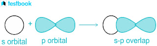
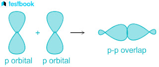
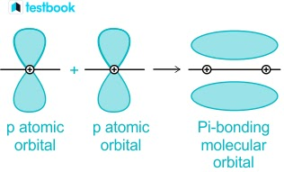
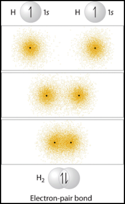
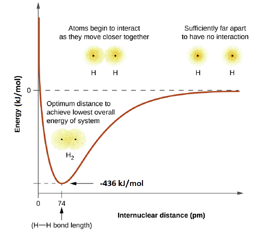

# 1.3.11 价键理论 - Valence Bond Theory

 

关于"共价键的本质是什么"这个问题，有2种常见的理论：价键理论和分子轨道理论。

 

价键理论（Valence bond theory，VB theory）把共价键解释为：

1. 原子的价电子为8（s，p亚层全满）或者18（s，p，d亚层全满）时最稳定。（对于H和He，价电子为2时最稳定）
2. 共价键本质上是两个未填满（即只含有1个电子）的原子轨道的重叠。原子轨道重叠后，系统的能量降低。
3. 两个电子定域地（localized）处在两个原子中间，即，电子不会出现在分子的其余部分。

 

如果成键的轨道"头碰头"式重叠（即重叠部分没有节点），则形成一个σ键。σ键可以由2个s轨道，1个s和一个p轨道，或2个p轨道等形成。

 

如果成键的轨道"肩并肩"式重叠（即重叠部分有一个节点），则形成一个π键。π键可以由2个p轨道，或1个p和一个d轨道形成。

 

如果成键的轨道"面对面"式重叠（即重叠部分有两个节点），则形成一个δ键。δ键可以由2个d轨道形成。

考虑到对称性和能量最低原则，单键总是由1个σ键组成，双键总是由1个σ键和1个π键组成，叁键总是由1个σ键和2个π键组成。不可能由2个π键组成双键。

 

下图为2个H原子，通过重叠1s轨道形成H-H单键的过程（即形成H2分子的过程）。

 

系统的能量取决于轨道重叠的程度（即H-H原子之间的距离）。下图反应了H2分子系统的能量随H-H距离的变化。

形成键可以使得总能量降低。使得总能量最低的H-H距离就是H2分子的键长。降低的能量就是H2分子的键能。

 

价键理论比较符合化学初学者对分子的直观想象，并且可以非常直观且准确地研究普通的无机物和有机物等成键简单的分子。

但价键理论有局限性，比如无法解释氧气的顺磁性，以及无法解释更复杂的化学键，如乙硼烷的3中心2电子键。

《物理化学》部分将对价键理论进行更深入的讨论。

 

---

对本节内容有贡献的科学家包括：

- 海特勒，伦敦，鲍林：提出价键理论

 

图片来源：

- https://testbook.com/chemistry/sigma-and-pi-bond
- https://chem.libretexts.org/ Bookshelves/ Organic_Chemistry/ Organic_Chemistry_%28Morsch_et_al.%29/ 01%3A_Structure_and_Bonding/ 1.05%3A_Describing_Chemical_Bonds_-_Valence_Bond_Theory