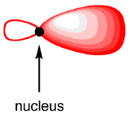
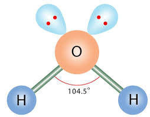
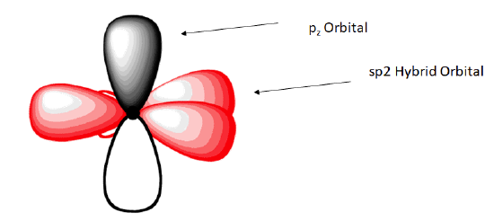
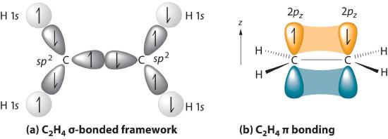

# 1.3.12 杂化轨道理论 - Hybridization Theory

 

价键理论认为，当中心原子的键数+孤对电子数大于1时，**为了使得各个键或孤对电子的排斥力最小，中心原子的部分原子轨道会发生杂化（hybridization），形成杂化轨道（Hybrid orbitals）。中心原子的参与杂化的轨道的数量，等于其最终形成的σ键的数量+孤对电子的数量。**

注：对于一些过渡金属的配合物来说，其d轨道上的孤对电子不一定参与杂化。

 

**常见的杂化方法有sp3杂化（即，由1个s轨道和3个p轨道杂化形成4个sp3杂化轨道），sp2杂化，sp杂化。**如果d轨道也参与杂化，可能会形成sp3d2杂化或sp3d杂化。

以甲烷（methane，CH4）为例：

甲烷分子的中心C原子最终要形成4个C-H σ键，所以其杂化方式为sp3杂化，以形成4个sp3杂化轨道。

在甲烷分子中，C原子有4个价电子，在基态时，这四个价电子的排布方式为2s22p2。当C原子与4个H原子成键时：C原子的2s，2px，2py，2pz轨道线性组合成4个等价的杂化轨道，即发生sp3杂化。杂化完成后，每一个杂化轨道上填充一个电子。

{: style="width:700px" }

 

每一个sp3轨道的形状均一致，如下图所示。为了最大限度地减少电子之间的排斥力，4个sp3轨道的大瓣组成一个正四面体，每两个杂化轨道之间的夹角为109.5°。

 

之后，4个H原子的s轨道与4个C原子的sp3轨道形成4个σ键，形成甲烷分子。甲烷分子的4个键的能量相同，键长相等。

 

与甲烷分子类似，水分子中的氧原子也进行sp3杂化，生成4个sp3轨道。其中2个未填满轨道与2个H原子结合形成2个σ键，另外2个填满的轨道上有2对孤对电子。

孤对电子的"体积"比键更大，所以孤对电子之间的排斥力 > 孤对电子与键之间的排斥力 > 键之间的排斥力。

因此，水分子中，H-O-H的键角略小于正四面体的109.5°，变成104.5°。

 

思考1：请判断氨分子（NH3）中的N原子的杂化形式。你认为氨分子中的H-N-H键角会比水分子中的H-O-H键角大吗？

 

在乙烯分子（C2H4）中，每个C原子最终要形成2个C-H σ键和一个C-C σ键，所以其杂化方式为sp2杂化。

C原子的2s，2px，2py轨道线性组合成3个等价的杂化轨道，称作3个sp2杂化轨道。这三个sp2杂化轨道互相之间的夹角近似为120°，且与2pz轨道垂直。

这三个sp2杂化轨道分别与2个H原子和另外的C原子形成3个σ键。

{: style="width:700px" }

 

剩余的2pz轨道与另一个C原子的2pz轨道形成一个π键。C-C之间有一个σ键和一个π键，共享2对电子，形成一个双键。

{: style="width:700px" }

 

在乙炔分子（C2H2）中，每个C原子最终要形成1个C-H σ键和一个C-C σ键，所以其杂化方式为sp杂化。

{: style="width:700px" }

 

剩余的2pz轨道与另一个C原子的2pz轨道形成一个π键，2py轨道与另一个C原子的2py轨道形成另一个π键。C-C之间有一个σ键和两个π键，共享3对电子，形成一个叁键。

 

思考2：请判断氮气分子（N2）中的N-N键的种类，以及N原子的杂化形式。

 

注："杂化"更多的是一种数学上的构造，用于描述和预测分子中原子的电子排布和分子的几何结构。没有实验可以探测到杂化轨道。

 

---

思考1答案：

氨分子（NH3）中N原子的杂化形式为sp3杂化。氨分子中的H-N-H键角（107°）会比水分子中的H-O-H键角（104.5°）大，因为氨分子只有一对孤对电子，而水分子有两对孤对电子。

思考2答案：

每个N原子有5个价电子，需共享3对电子才能维持8电子构型。氮气分子中的键为叁键。

所以，每个N原子有一个叁键和一个孤对电子，N原子采用sp杂化。

 

对本节内容有贡献的科学家包括：

- 鲍林：提出杂化轨道理论

 

图片来源：

- https://chem.libretexts.org/ Bookshelves/ Organic_Chemistry/ Organic_Chemistry_(Morsch_et_al.)/ 01%3A_Structure_and_Bonding/1.06%3A_sp_Hybrid_Orbitals_and_the_Structure_of_Methane
- https://www.chemicalbook.com/article/the-lewis-structure-and-molecular-geometry-of-h2o.htm
- https://chem.libretexts.org/ Bookshelves/ Organic_Chemistry/ Organic_Chemistry_(Morsch_et_al.)/ 01%3A_Structure_and_Bonding/ 1.08%3A_sp_Hybrid_Orbitals_and_the_Structure_of_Ethylene
- https://chem.libretexts.org/ Bookshelves/ Organic_Chemistry/ Organic_Chemistry_(Morsch_et_al.)/ 01%3A_Structure_and_Bonding/ 1.09%3A_sp_Hybrid_Orbitals_and_the_Structure_of_Acetylene