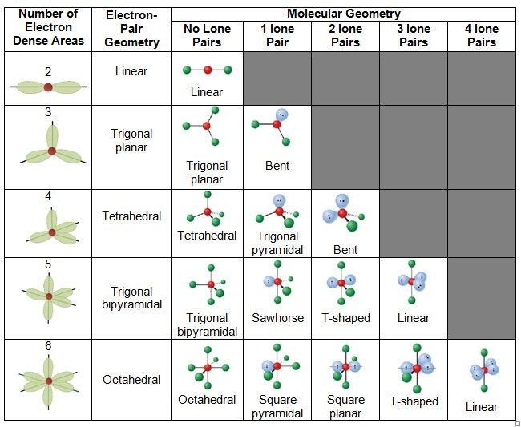

# 1.3.13 VSEPR理论 - VSEPR Theory

 

价层电子对互斥（Valence Shell Electron Pair Repulsion，VSEPR）理论 使用中心原子的化学键数量和孤对电子数量 来预测分子结构。

 

中心原子指与多于一个其他原子键合的原子，末端原子为仅与一个其他原子键合的原子。

由于电子对之间存在静电排斥，因此最稳定的结构是使排斥力最小化的结构。在中心原子周围，可以产生排斥力的电子对包括孤对电子和化学键（此时双键，叁键均算作一个化学键，因为双键和叁键也仅占用中心原子周围的一个位点），孤对电子数+化学键数称作中心原子的空间位数（Steric number）（即下图的电子对数，或Number of Electron Dense Areas）。

若中心原子除了孤对电子外，还存在未成对电子，则未成对电子也会对中心原子周围的电子对产生排斥力，可当作孤对电子处理。

VSEPR理论预测：**孤对电子和化学键以排斥力最小的方式排布在中心原子周围。**下图为 不同空间位数/孤对电子数的 中心原子周围的化学键及孤对电子的排布图。

{: style="width:700px" }

 

下文中使用AXmEn来描述一个中心原子具有m个化学键和n个孤对电子的分子或离子的结构。

AX2类型的分子（即中心原子有2个化学键，没有孤对电子的分子）的几何形状为直线型（linear）。键角为180°，使得这两个键之间的距离最远。CO2属于AX2类型的分子。

AX3类型的分子的几何形状为平面三角型（trigonal planar）。键角为120°（或接近120°，取决于三个键连接的原子或基团的尺寸，下略），BCl3分子属于AX3类型的分子，CO32-离子属于AX3类型的离子。

AX4类型的分子的几何形状为四面体型（tetrahedral）。键角为109.5°。CH4属于AX4类型的分子，SO42-离子属于AX4类型的离子。。

AX5类型的分子的几何形状为三角双锥型（trigonal bipyramidal）。键角有3种，分别为90°，120°和180°。PCl5属于AX5类型的分子。注意对于这种分子来说，两极向的键上的原子受到的排斥力（3个90°和1个180°）要比赤道面的键上的原子（2个90°和2个120°）排斥力大。

AX6类型的分子的几何形状为八面体型（octahedral）。键角有2种，分别为90°和180°。SF6属于AX6类型的分子。

 

AX2E1类型的分子（即中心原子有2个化学键和1对孤对电子的分子）的几何形状为V字型（又称弯曲型，角型，bent），即AX3类型的分子的一个键被孤对电子取代的结构。键角应为略小于120°。SO2属于AX2E1类型的分子，NO2-离子属于AX2E1类型的离子。

AX3E1类型的分子的几何形状为三角锥型（trigonal pyramidal）。键角应为略小于109.5°。NH3属于AX3E1类型的分子。

AX2E2类型的分子的几何形状为V字型（bent），键角应为略小于109.5°。H2O属于AX2E2类型的分子。

AX4E1类型的分子的几何形状为锯架型（又称跷跷板型，变形四面体型，sawhorse）。SF4属于AX4E1类型的分子。注，由于孤对电子的排斥作用比键要强，所以孤对电子往往占据赤道面上的位置。

AX3E2类型的分子的几何形状为T字型（T-shaped）。ClF3属于AX3E2类型的分子。

AX2E3类型的分子的几何形状为直线型（linear）。XeF2属于AX3E2类型的分子。

AX5E1类型的分子的几何形状为金字塔型（又称四角锥型，square pyramidal）。ClF5属于AX5E1类型的分子。

AX4E2类型的分子的几何形状为平面正方型（square planar）。XeF4属于AX4E2类型的分子。

 

如果分子有2个及以上的中心原子，在预测结构时需要对每个中心原子分别考虑。比如乙烯分子，每个C原子采用sp2杂化，成3个键，为AX3类型，所以每个C原子与其周围原子（指2个H原子和另一个C原子）的结构为平面三角形。整个乙烯分子的结构为平面结构。

 

思考1：请判断以下分子或离子的中心原子AXmEn类型与结构：

- SO2

- PO43-

- ClO4-

- H2O2

- C2H6

 

注：对于过渡金属（即第3，4，5，6，7，8，9，10，11，12族的金属，比如 钪钛钒铬锰铁钴镍铜锌 ）其d轨道上的孤对电子不影响分子的结构，所以应用VSEPR理论时要忽略过渡金属原子上的所有孤对电子。

此外，VSEPR在少数情况下不准确。比如硅炔是双桥结构而不是VSEPR预测的线性结构。

 

---

思考1答案：

- SO2：AX2E1，V字型

- PO43-：AX4，四面体型

- ClO4-：AX4，四面体型

- H2O2：每个O原子为AX2E2，V字型。对于整个分子：N字型

- C2H6：每个C原子为AX4，四面体型。对于整个分子：三棱柱或反三棱柱型

 

对本节内容有贡献的科学家包括：

- 吉莱斯皮，尼霍姆：开发VSEPR理论

 

图片来源：

- https://quizlet.com/671099281/molecular-shapes-vsepr-theory-diagram/