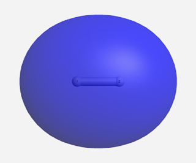
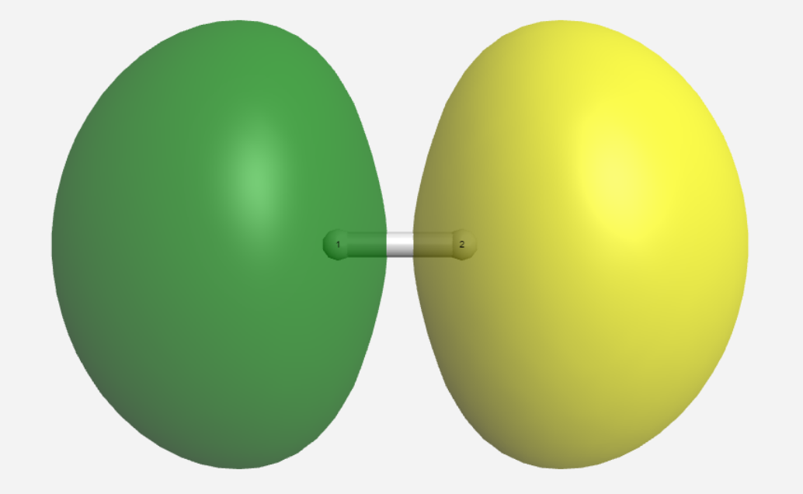
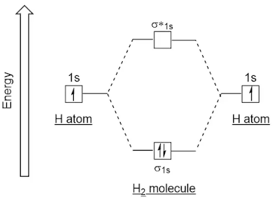
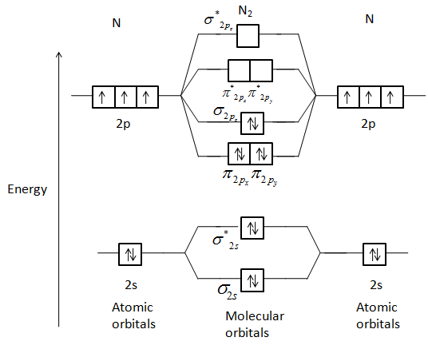

# 1.3.14 分子轨道理论 - Molecular Orbital Theory

 

除了价键理论之外，分子轨道理论是另一种解释共价键的理论，其更不直观，但数学模型更简单，且解释效果更好。

 

从原子轨道构建分子轨道（Molecular Orbital，MO，分子中的电子的运行"轨道"，即分子中的原子核电场中电子薛定谔方程的近似解）的方法不唯一，通常使用原子轨道线性组合（Linear combination of atomic orbitals，LCAO）方法，获得相对准确的分子轨道。

在LCAO方法中，原子轨道线形叠加组成分子轨道。当2个原子靠近时，其原子轨道在空间上可能会部分重叠，这会使得填充此轨道的电子的波函数部分重叠，位于重叠区域的波函数值由两个电子的波函数相加决定。

 

如果组合得到的分子轨道能量比组合前原子轨道能量的平均：

- 更低，那么所得分子轨道称作成键轨道（bonding MO）。
- 更高，那么所得分子轨道称作称作反键轨道（antibonding MO），以*标注。
- 相差不大，轨道上的电子对分子键合没有贡献，那么所得分子轨道则称作非键轨道（non-bonding MO），常以n标注。

 

并不是任意两个原子轨道都能形成分子轨道，形成分子轨道有3个原则：

1. 对称性匹配原则：原子轨道必须具有相同的对称性才能组合成分子轨道，否则波函数相加后会相互抵消。
2. 最大重叠原则：原子轨道在空间中的距离更近（即重叠程度越大），形成的化学键也越强。
3. 能量相近原则：只有能量相近的原子轨道才能有效地组成分子轨道。能量越接近，组合成的成键轨道的能量越低。

 

以H2为例：在H2中，2个1s原子轨道重叠会形成2个分子轨道：一个成键轨道σ1s，和一个反键轨道σ*1s。

 

在成键轨道中：

重叠区域的电子波函数的符号相同（即a电子的波函数的正值区域与b电子的波函数的正值区域部分重叠，或a电子的波函数的负值区域与b电子的波函数的负值区域部分重叠），导致重叠区域的两个电子的波函数相加后的绝对值比每个电子的波函数的绝对值都要大，导致重叠区域的电子密度（波函数相加后的平方）更大。如图所示。

由于原子轨道的重叠区域在2个原子之间，波函数重叠意味着出现在2个原子之间的电子密度增大。

如果电子在成键轨道中，这部分电子（带负电）会吸引2个原子核（带正电）向中间聚集。这个吸引力即为共价键。当原子被共价键牵引，互相靠近时，整个系统的能量就会随之降低。

 

在反键轨道中：

重叠区域的电子波函数的符号不同（即a电子的波函数的正值区域与b电子的波函数的负值区域部分重叠），导致重叠区域的两个电子的波函数相加后的绝对值比电子的波函数的绝对值的大值要小，导致2个原子核之间的区域的电子密度更小。相反，在2个原子核之外的区域，电子密度更大。如图所示。

如果电子在反键轨道中，则会倾向于将原子核拉远，相当于增加了分子的能量，弱化了共价键。

{: width="50%"}

 

当2个H原子形成H2分子时，如果2个电子均排布在成键轨道上，会使得分子整体的能量 比2个电子均处在原子轨道上的能量要低。而如果2个电子均排布在反键轨道上，会使得分子整体的能量 比2个电子均处在原子轨道上的能量要高。

下图显示了这一过程。2个1s方框表示2个H原子轨道，σ1s和σ\*1s表示由这两个1s轨道线性组合形成的成键分子轨道和反键分子轨道。σ\*1s轨道的能量最高，1s轨道次之，σ1s轨道的能量最低。

 

在分子中，电子在分子轨道中的填充方式与在原子中填充原子轨道的方法类似：从低到高填充，每个轨道最多填2个电子。

由于2个H原子各有1个电子，所以2个电子填充进σ1s成键轨道中。从电子分布的角度来看，两个原子各有1个电子"移向"了两个原子中间，形成1个共价键。

 

He2分子具有类似的分子轨道，但是He2分子有4个电子，将填满σ1s成键轨道和σ*1s反键轨道，导致最终的分子的能量并没有降低，导致He2分子常温下并不存在。

 

在H2分子的所有分子轨道中，最高占据电子轨道（highest occupied molecular orbital, HOMO）为σ1s轨道，最低未占据电子轨道（lowest unoccupied molecular orbital，LUMO）为σ\*1s轨道。**这两个轨道对分子的化学性质的影响较为明显。**

 

在更复杂的分子中，原子轨道线性组合形成的分子轨道更加复杂。下图为N2的分子轨道图（省略了两个1s组成的2个σ1s轨道）。

由图可知，N2的HOMO轨道为σ2pz，LUMO轨道为π\*2px和π\*2py。

 

与原子轨道类似，电子在分子轨道中的填充方式可以由电子排布式表示。比如，

H2的电子排布式为：(σ1s)2。

N2的电子排布式为：(σ1s)2(σ\*1s)2(σ2s)2(σ\*2s)2(π2px)2(π2py)2(σ2pz)2。

 

共价键的键级（bond order）定义为 (成键轨道的电子数-反键轨道的电子数)/2。H-H键有一个填满的成键轨道，没有填满的反键轨道，所以H-H键的键级为1。

成键轨道上的电子增加共价键的强度，反键轨道上的电子降低共价键的强度，所以键级某种程度上反应共价键的强度。

通常来说，单键的键级为1，双键的键级为2，叁键的键级为3。

思考1：请通过图片，或电子排布式，计算N2分子的键级。

 

如果分子轨道具有相同的能量，则称它们是简并的（Degenerate）。比如，N2分子的π2px和π2py轨道为简并轨道。

 

---

思考1答案：

N2分子的键级为3。

 

对本节内容有贡献的科学家包括：

- 穆利肯：发展了分子轨道理论

 

图片来源：

- https://www.quora.com/What-is-the-LCAO-treatment-of-a-hydrogen-molecule
- https://www.vedantu.com/question-answer/draw-a-molecular-orbital-diagram-of-n2-or-o2-class-11-chemistry-cbse-5f7c7d3d63e3867bef767702