# 1.3.15 干实验：计算水分子的结构 - Dry Lab: Calculate the Structure of Water Molecule

 

化学实验是一种基本的科学研究方法，旨在通过实际操作探索和验证化学原理和物质的性质。

干实验（dry lab，又称计算化学实验）是一种特殊的实验方法，虽然它不同于传统的实验室中进行的化学实验，但它同样能够提供有关化学反应和物质性质的重要信息。干实验它不需要任何化学试剂和仪器，适合在没有条件进行化学实验的情况下，进行化学研究。

 

本实验将使用计算化学方法（即从量子力学的基本原理出发，通过解薛定谔方程，不依赖任何经验参数或先前的实验数据，"从头"（Ab initio）得到分子的信息。），计算水分子的键长，键角等结构信息。

本实验将使用WebMo作为平台构建分子，并使用Gaussian16软件进行几何结构优化计算。

 

首先，无需注册，使用"guest"作为账号登录WebMo，密码也为"guest"。

[https://www.webmo.net/demoserver/cgi-bin/webmo/login.cgi](https://www.webmo.net/demoserver/cgi-bin/webmo/login.cgi)

 

登录成功后，将显示WebMo的Job Manager页面。

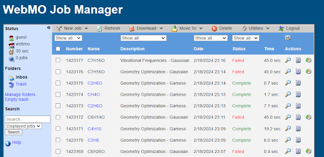

 

点击New Job，在下拉菜单里选择Create New Job，进入Build Molecule界面

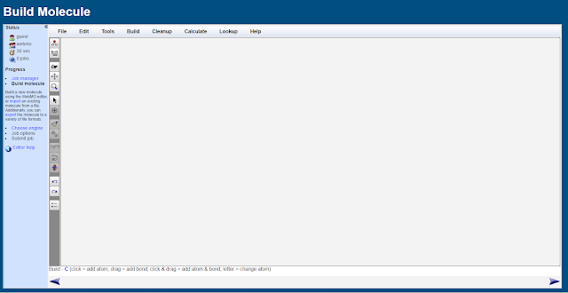

 

从左边工具栏中选择Periodic Table工具（从上往下数第二个），选择O原子。

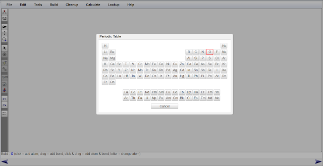

 

在屏幕中间点击，这样你就构建了一个O原子。

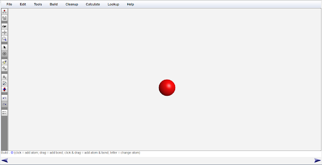

 

继续选择Periodic Table工具，选择H原子。从氧原子处向另一个方向拖动，你就为氧原子添加了一个连接的氢原子。再次重复拖动，你就获得了一个水分子。

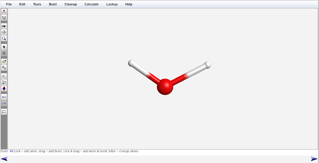

 

为了使得优化的速度更快一些，我们使用clean up工具（左边工具栏的刷子工具）。单击刷子，我们"依据几何经验"，对水分子的构型进行初步优化。

这一步的目的是获得一个更合理的结构用来优化，减少优化的步数。

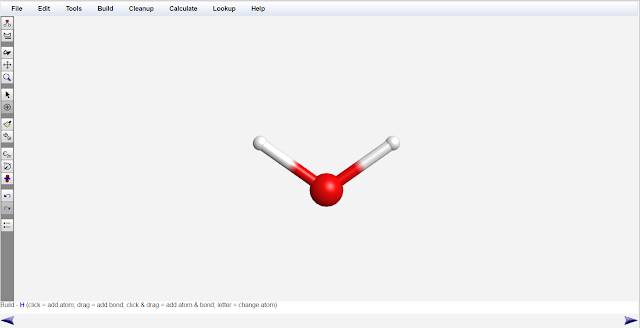

 

点击右下角的箭头。在选择计算化学软件一页中选择Gaussian。

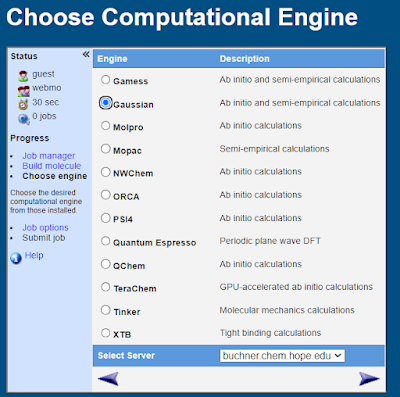

 

再次点击右下角的箭头，在Calculation一栏中选择Geometry Optimization（几何结构优化），在Theory一栏中选择B3LYP。在Basis Set一栏中选择6-31G(d)。

B3LYP/6-31G(d)是一套计算结果比较精确的计算方法，其耗时也相对较短。

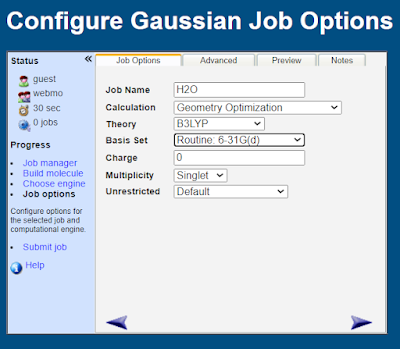

 

再次点击右下角的箭头，提交计算任务。

 

几秒钟后，计算完成了，单击计算任务的名称（即图里的H2O），查看此任务。你将看到优化过的水分子的结构。

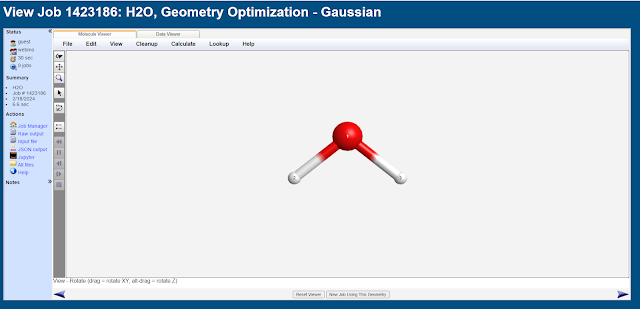

 

使用选择工具（左边工具栏的箭头工具），选择O原子（红色）和1个H原子（白色）。即可从左下角查看O-H键长，在本例中为0.969A（0.0969nm）。

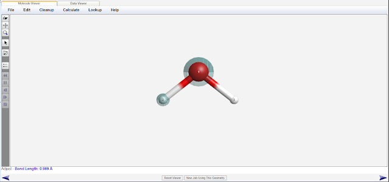

 

点击空白部分取消选择，再次选择H原子-O原子-另一个H原子，查看H-O-H键角，在本例中为103.672°。

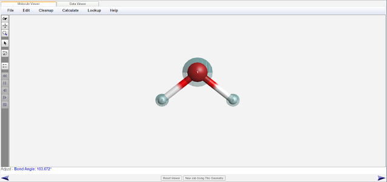

此键长和键角即为Gaussian16在B3LYP泛函和6-31G(d)基组下对水分子的键长和键角的计算。

 

相比于水分子的键长和键角的实验值（0.096nm，104.52°），我们得到的键长的误差为0.94%，键角的误差为0.81%。键长和键角的误差均小于1%，反过来证明我们使用的计算方法是合理的。干实验也能提供一定精度的实验数据。

注：误差的计算公式为 |(计算值-真实值)| / 真实值 * 100%

 

另，在WebMo的任务结果页面，向下滚动屏幕，能看到有关水分子的另一些信息，包括对称点群和偶极矩。

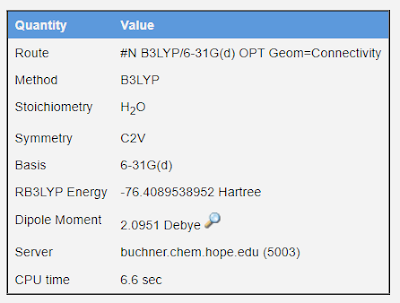
