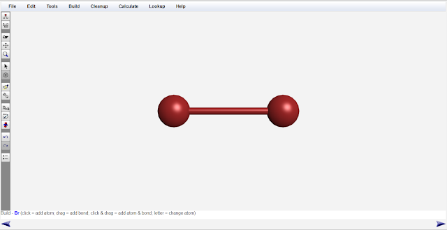
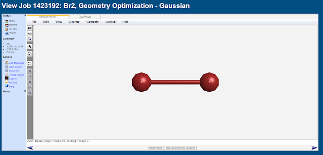
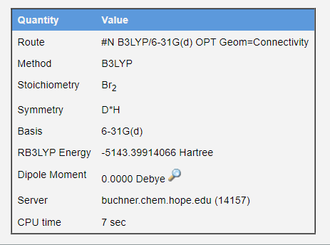
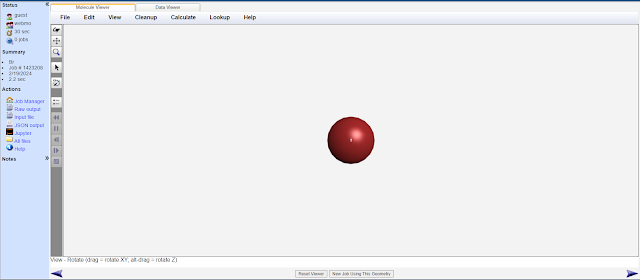
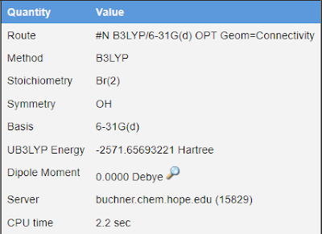
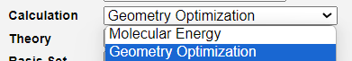

# 1.3.16 干实验：计算溴气分子的键能 - Dry Lab: Calculate the Bond Energy of Bromine Molecule

 

本实验将使用计算化学方法，计算Br2分子中Br-Br键的键能。

 

与1.3.15节相同，本实验将使用WebMo作为平台构建分子，并使用Gaussian16进行几何结构优化计算。

首先，无需注册，使用"guest"作为账号登录WebMo，密码也为"guest"。

[https://www.webmo.net/demoserver/cgi-bin/webmo/login.cgi](https://www.webmo.net/demoserver/cgi-bin/webmo/login.cgi)

 

登录到WebMo的Job Manager页面之后，点击New Job，在下拉菜单里选择Create New Job，进入Build Molecule界面。选择Periodic Table工具，选择Br原子。单击屏幕以添加一个Br原子。之后，从Br原子处向另一方向拖拽，以添加一个和Br原子相连的Br原子。最后使用clean up工具，对Br2分子的构型进行基于经验的初步优化。

构建好的Br2分子如图所示。

 

使用与1.3.15节相同的方法提交计算任务：点击右下角的箭头。在选择计算化学软件一页中选择Gaussian。再次点击右下角的箭头，在Calculation一栏中选择Geometry Optimization（几何结构优化），在Theory一栏中选择B3LYP。在Basis Set一栏中选择6-31G(d)。再次点击右下角的箭头，提交计算任务。等待10s左右。

 

单击计算任务的名称（即图里的Br2），查看此任务。

 

向下滚动，查看Br2分子优化后的结构的单点能（single point energy）。在本例中其名称为RB3LYP Energy，值为-5143.39914066 Hartree。

 

之后，使用WebMo，使用完全相同的方法，计算Br原子的单点能。计算结果为-2571.65693221 Hartree。

 

化学键的键能指破坏掉1mol化学键（即"拉开"成键的原子，使其距离无限远）所需的能量。Br2分子的能量为-5143.39914066 Hartree，而2个无限远的Br原子的能量为2 × (-2571.65693221) Hartree。列出等式：

Br2中Br-Br键能 = 2 × Br原子的能量 − Br2分子的能量 = 2 × (-2571.65693221) -  (-5143.39914066) Hartree = 0.085276 Hartree ≈ 223.89 kJ/mol

 

Br2键能的实验值为193KJ/mol，计算误差为16.01%。

 

思考1（超纲警告）：在选择Calculation type的时候，如果我们选择Molecular Energy 而不是 Geometry Optimization，Gaussian将不会优化分子的几何结构，而是直接计算原始的结构的单点能。请问，对于本次实验：  
1. 我们可以不优化Br2分子的几何结构，直接计算Br2分子的单点能吗？  
2. 我们可以不优化Br原子的几何结构，直接计算Br原子的单点能吗？

 

---

思考1答案：

1. 不能不优化Br2分子的几何结构。几何结构优化的目的是找到分子的能量最低（即最稳定）的构型。如果不优化，计算出的分子能量会高于分子的真实能量，导致计算出的键能偏小。clean up工具仅仅是在经验层面上对分子进行简单优化，并没有量子力学层面上的精度。  
2. 可以不优化Br原子的几何结构，原子并没有键长或键角等可被优化的结构。