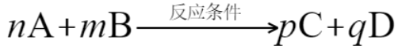

# 1.4.1 化学反应 - Chemical Reaction

 

**化学反应（Chemical reaction）是一组化学物质化学转化为另一组化学物质的过程。**

化学反应所涉及的变化仅涉及原子间化学键形成和断裂，即化学物质中电子位置的变化。在化学反应中，原子核没有变化。化学反应中会发生化学变化。

 

化学反应可以用化学方程式（Chemical equation）表示。“n个A粒子和m个B粒子发生化学反应，生成p个C粒子和q个D粒子”的化学方程式如下所示：

其中，A和B是参与化学反应的物质，称为反应物（reactant）。C和D是化学反应生成的物质，称为生成物，或产物（product）。

从宏观上来说，此化学方程式也可以表示"n摩尔A和m摩尔B发生化学反应，生成p摩尔C和q摩尔D" 。

 

有些化学反应需要特定的反应条件，比如加热（△），点燃，电解，光照（hν），高温，低温，高压，减压，以及特定的催化剂。为了强调化学反应的反应条件，通常将其标注在箭头符号上方，上方标记满了也可标注在箭头符号下方。（出于排版的方便，在本指南中，将其标记在箭头符号的中间。）

 

n，m，p，q为化学计量系数（stoichiometric coefficient），简称系数（coefficient）。各系数通常为整数。当某个物质的系数为1时可省略。

**在化学反应中，物质守恒。即，化学反应前后，各原子的个数不变。**我们可以利用这一定律配平化学方程式（即确定化学方程式中各物质的系数）。

比如，对于氢气燃烧反应：H2+O2 —点燃→ H2O 由于产物为H2O，说明产物中氢氧原子的个数比为2：1，反应物中氢氧原子的个数比也应为2：1，所以应在H2前添加系数2。此时反应物一侧有4个H原子和2个O原子，对应2个H2O分子，所以也应在H2O前添加系数2。最终的氢气燃烧反应的化学方程式为 2H2+O2 —点燃→ 2H2O

对于更复杂的化学方程式，可以通过列方程，计算氧化态变化，以及一点点化学经验来配平。

思考1：请配平以下化学方程式：  

- Mg+O2 —点燃→ MgO  
- H2SO4+Fe(OH)3 → Fe2(SO4)3+H2O  
- C+HNO3(浓) —△→ NO2+CO2+H2O  

 

有时，为了强调反应很彻底，且没有副反应，可以用长等号代替化学方程式中的长箭头。比如：

2H2+O2 =点燃= 2H2O

注：通常来说，涉及有机物的反应总是有很多副反应，且反应往往不彻底（燃烧反应除外），只有无机反应才能达到以上两点。

有时，为了强调各物质的物理状态，可以在化学方程式中用括号标记出来。s为固体，l为液体，g为气体，aq为溶液。如下所示。

2H2(g)+O2(g) —点燃→ 2H2O(l)

为了强调一些明显的实验现象（比如产生气体或产生沉淀），可以使用上箭头↑和下箭头↓。当在特定的温度下，各反应物都不是气体，但是产物包含气体时，在该产物的右侧标记↑。当各反应物都可溶，但是产物包含沉淀时，在该产物的右侧标记↓。

注：虽然长等号，上下箭头等标记是可选的，但是在国内初中/高中教材中，可能会强制要求使用这些标记。请读者以各自的教材和考试要求为准。

 

以下为一些常见的化学反应，建议读者用几分钟时间熟悉一下：

- 碳在足量的空气中燃烧 C+O2 —点燃→ CO2 （或者 C+O2 =点燃= CO2 ，下略）  
- 氢气燃烧 2H2+O2 —点燃→ 2H2O  
- 铁在潮湿的空气中生锈 4Fe+3O2+2nH2O → 2Fe2O3·nH2O  
- 加热过氧化氢制氧气（实验室制氧气）2H2O2 —△→ 2H2O+O2  
- 细胞内的葡萄糖的有氧呼吸 C6H12O6+6O2 —酶→ 6H2O+6CO2  
- 电解水 2H2O —电解→ 2H2↑+O2↑  
- 锌和稀硫酸反应（实验室制氢气）Zn+H2SO4 → ZnSO4+H2↑  
- 盐酸和氢氧化钠反应 NaOH+HCl → NaCl+H2O  
- 氯化钠溶液和硝酸银溶液反应 NaCl+AgNO3 → NaNO3+AgCl↓  

 

以下为一些常见的非化学反应：

- 水蒸发形成水蒸气（物理反应，因为水和水蒸气属于同一物质）  
- 块状食盐研磨成粉末（物理反应）  
- 硫酸铜溶解（物理反应）  
- 核聚变，核裂变（核反应）  

 

思考2：请逐条搜索以下反应，并判断其是否为化学反应。 

- 用明矾 KAl(SO4)2·12H2O 净化水  
- 少量生石灰CaO溶解在水中  
- 新切开的金属钠表面由银白色变成暗灰色  
- 用碳化硅SiC砂轮磨掉铁锈。  

 

---

思考1答案：

- 2Mg+O2 —点燃→ 2MgO  
- 3H2SO4+2Fe(OH)3 → Fe2(SO4)3+6H2O  
- C+4HNO3(浓) —△→ 4NO2+CO2+2H2O  

思考2答案：

- 用明矾 KAl(SO4)2·12H2O 净化水：物理反应。明矾在水中溶解后，通过吸附作用去除水中的杂质。

- 少量生石灰CaO溶解在水中：化学反应。CaO与H2O反应生成Ca(OH)2。

- 新切开的金属钠表面由银白色变成暗灰色：化学反应。金属钠与空气中的氧气和水蒸气反应，生成氧化钠和氢氧化钠。

- 用碳化硅SiC砂轮磨掉铁锈：物理反应。这是一个机械去除的过程，没有新物质生成。