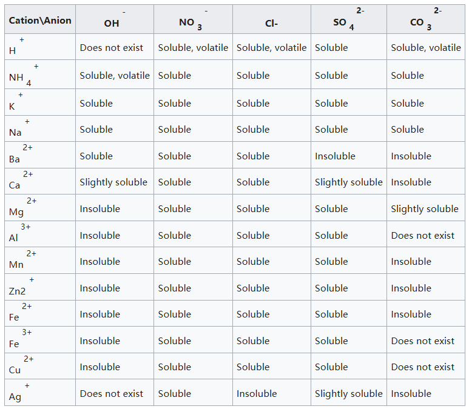

# 1.4.3 溶液与电离 - Solutions and Ionization

 

将少量食盐（NaCl）投入水中，食盐分子会逐渐扩散到水中，直至固体物质消失。此过程中，食盐为溶质，水为溶剂，最终得到的液体物质为食盐水溶液，简称食盐溶液，这一过程叫做食盐的溶解（Dissolution）。

溶液（Solution）是由两种（或多种）物质组成的均匀混合物（Homogeneous mixture）。在这种混合物中，溶质（Solute）是均匀分散在另一种物质（即溶剂，Solvent）中的物质。[[1]](https://en.wikipedia.org/wiki/Solution_(chemistry))通常来说，溶质的量较少，溶剂的量较多。溶质，溶液都可以是固体、液体或气体。

水是化学研究中最常用的溶剂。

当溶解发生时，溶质分离成离子或分子，每个离子或分子都被溶剂分子包围。溶质颗粒和溶剂分子之间的相互作用称为溶剂化（Solvation）。[[2]](https://chem.libretexts.org/Bookshelves/General_Chemistry/General_Chemistry_Supplement_(Eames)/Chemical_Reactions_and_Interactions/Solutions_Solvation_and_Dissociation)

 

溶液中溶质的浓度可以用溶质的量（质量，或者物质的量）与溶液的体积之比来表示。物质的量浓度（摩尔浓度）是溶质的物质的量（摩尔数）与溶液的体积之比，通常用c表示，单位为mol/L；质量浓度是溶质的质量与溶液的体积之比，单位为g/L。

思考1：将111g CaCl2 溶解在2L水中，求CaCl2的质量浓度和摩尔浓度。CaCl2的摩尔质量近似为111g/mol。

 

溶剂可以溶解溶质的量往往是有限的，当溶质的量超过溶剂的溶解能力时，溶质无法继续溶解，此时溶液已经饱和（Saturated），称作饱和溶液。溶质和溶剂分子之间的相互作用力的大小决定了溶质的饱和浓度。溶质的饱和浓度与溶质和溶剂分子的极性有关。

注，也有一些溶质在一些溶剂中不会饱和，比如，水和乙醇可以以任意比例互溶，所有气体之间的溶解也都不会饱和。

通常来说，如果溶质的饱和浓度高于1g/L，称作可溶；如果溶质的饱和浓度在0.01g/L至1g/L之间，称作微溶；如果溶质的饱和浓度低于0.01g/L，称作不溶。以下为一些常见的离子化合物的溶解性。

 

中性粒子转化为带电粒子的过程称作电离（Ionization）。

注：在化学范畴中，“电离”一词通常只用于描述2种过程：一是电中性（即不带有电荷）的原子或分子获得或失去电子，从而形成离子，之前的章节提及的电离过程均属于此过程。二是离子性较强的化合物，在溶液中分解为正负离子的过程，本章讨论的电离过程属于此过程。

 

在水溶液中，离子化合物，和离子型较强的共价化合物在溶解时会发生电离，分解为正负离子。而离子型较弱的共价化合物在溶解时不会发生电离，仍保持分子状态。含有正负离子的，可以导电的物质（比如含有离子的溶液）称作电解质（Electrolyte）。当电极（Electrodes）放入电解质中并施加电压（voltage）时，电解质就会导电。对溶液进行通电可以使得溶液发生非自发化学反应（Non-spontaneous chemical reaction），这一操作称作电解（Electrolysis）。

后续的章节将详细讨论电解过程。

 

此外，也称在溶解时能够电离的化合物为电解质（Electrolyte），不能电离的化合物为非电解质（Nonelectrolyte）。对于电解质化合物，如果在溶解时，几乎全部的溶质分子都发生电离，此电解质称作强电解质，此电离过程称作完全电离；如果只有一小部分溶质分子发生电离，此电解质称作弱电解质，此电离过程称作部分电离。离子化合物往往是强电解质，而共价化合物既有强电解质，也有弱电解质，也有非电解质。

注：在纯水中，水分子本身也会发生部分自发电离，形成水合氢离子 H3O+（常简化为氢离子 H+），和氢氧根离子 OH-。25℃时，纯水含有的氢离子和氢氧根离子的浓度分别为1.0×10-7mol/L和1.0×10-7mol/L。

- 常见的强电解质包括：HCl，HNO3，H2SO4，NaOH，NaCl，CaCl2，Na2SO4，NaNO3等。

- 常见的弱电解质包括：H2O，CH3COOH，HgCl2，NH4OH等。

- 常见的非电解质包括：C6H12O6，C12H22O11等。

 

因为溶液环境可以将溶质分散均匀，增加反应物之间的接触面积，所以很多反应在溶液中发生的速度要明显更快，或者仅在溶液中发生。比如，

Fe(s)+CuSO4(aq) → Cu(s)+FeSO4(aq) （铁与硫酸铜反应生成铜和硫酸铁）

此反应仅在溶液中会发生，在固体状态下则不会发生。

 

如果反应物在溶液中会电离，则此化学反应本质上是离子间的化学反应。事实上，上述铁和硫酸铜在溶液中的反应中，硫酸根离子并没有参与反应。我们可以将反应中所有电离的物质的阴阳离子写出来，并约掉反应前后不变的离子。则此方程式改写为：

Fe(s)+Cu2+(aq) → Cu(s)+Fe2+(aq)

含有离子的方程式即为离子方程式（Ionic equation），离子方程式中只包含参与反应的物质，不包含不参与反应的离子，更准确地描述了反应的本质。

思考2：将以下反应写成离子方程式：

- Na2CO3(aq)+2HCl(aq) → 2NaCl(aq)+H2O(l)+CO2(g)
- CaCl2(aq)+2NaOH(aq) → Ca(OH)2(s)+2NaCl(aq)

 

---

思考1答案：

CaCl2的质量浓度为111g/2L=55.5g/L，摩尔浓度为111g/111g/mol/2L=0.5mol/L。

思考2答案：

- CO32-(aq)+2H+(aq) → H2O(l)+CO2(g)
- Ca2+(aq)+2OH-(aq) → Ca(OH)2(s)

 

对本节内容有贡献的科学家包括：

- 阿伦尼乌斯（Arrhenius）：提出了电解质的概念，认为电解质在溶液中分解为正负离子。（1903年诺贝尔化学奖）